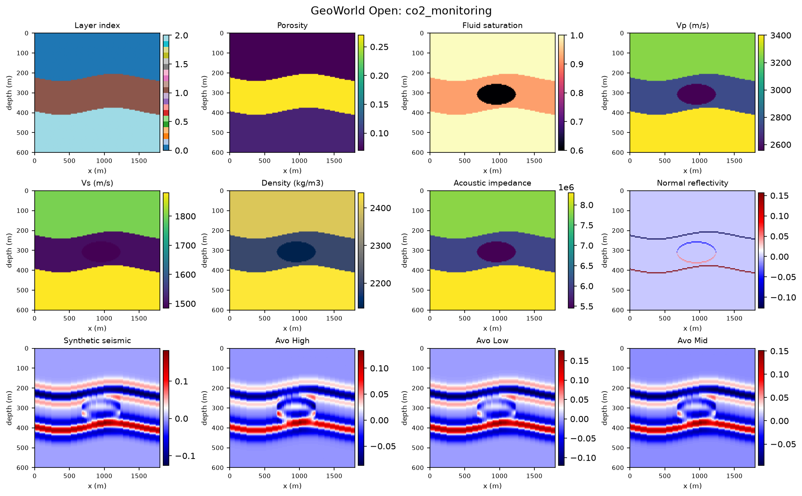
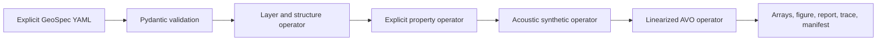

# GeoWorld Open

GeoWorld Open is a small, inspectable Python sandbox for turning a typed YAML scenario into a deterministic 2D synthetic earth model, elastic properties, seismic response, AVO angle stacks, and reproducibility artifacts.

> GeoWorld Open is a reproducible educational and research sandbox for typed synthetic geoscience workflows. The production GeoWorld platform includes proprietary orchestration, knowledge assets, configuration, evaluation, and operational capabilities not included here.



## What It Does

- Validates an explicit GeoSpec with strict Pydantic models.
- Builds analytic layers with optional sinusoidal folding and a planar fault.
- Assigns explicit porosity, saturation, Vp, Vs, and density values from YAML.
- Applies an optional elliptical saturation/property change clipped to a named layer.
- Computes acoustic impedance, normal-incidence reflectivity, a Ricker-convolved depth-domain response, and simplified Aki-Richards angle stacks.
- Writes normalized inputs, NumPy arrays, a figure, report, execution trace, and SHA-256 manifest.
- Runs through either a CLI or a standalone local Streamlit demo. Neither path needs an account, cloud service, database, or LLM.

## Architecture



The operators are intentionally transparent NumPy implementations. See [Architecture](docs/architecture.md), [Scientific Scope](docs/scientific-scope.md), and [Equation Derivations](docs/derivations.md).

## Quickstart

```bash
python -m venv .venv
source .venv/bin/activate
python -m pip install -e '.[dev,demo]'

geoworld-open run examples/scenarios/layered_reservoir.yaml \
  --output runs/layered_reservoir

streamlit run apps/streamlit_app.py
```

The CLI output contains:

```text
runs/layered_reservoir/
├── arrays/
├── manifest.json
├── report.md
├── scenario.yaml
├── summary.png
└── trace.json
```

A layer is explicit rather than inferred from a private property recipe:

```yaml
layers:
  - name: reservoir_sand
    lithology: sand
    thickness_m: 150.0
    porosity: 0.24
    saturation: 0.85
    vp_m_s: 2700.0
    vs_m_s: 1450.0
    density_kg_m3: 2180.0
```

The complete, validated examples are in [`examples/scenarios/`](examples/scenarios/).

Try the second public scenario:

```bash
geoworld-open run examples/scenarios/co2_monitoring.yaml \
  --output runs/co2_monitoring
```

## Tests

```bash
python -m pytest -q
python scripts/scan_secrets.py
python -m compileall -q src apps scripts tests
```

The initial clean-repository verification completed with `12 passed`. CI repeats tests and secret scanning without requiring any live service.

## Boundaries

This repository does **not** contain the production GeoWorld authentication, APIs, database, cloud deployment, LLM routing, prompts, agents, RAG, memory, telemetry, evaluations, private knowledge, calibrated geological recipes, advanced physics, or operational configuration. The public equations and scenario parameters are simplified and illustrative; outputs are not field-data inversion, fluid simulation, history matching, or engineering decisions.

Read [Limitations](docs/limitations.md) and [Security](SECURITY.md) before adapting it. Contributions are described in [CONTRIBUTING.md](CONTRIBUTING.md).

## Links

- [GeoWorld live demo](https://geoworld-studio.onrender.com/)
- [GeoWorld engineering blog](https://geoworld.hashnode.dev/)
- [scifiss on GitHub](https://github.com/scifiss)

## License

GeoWorld Open is licensed under the [Apache License 2.0](LICENSE). The license applies only to this repository and does not grant rights to the separate proprietary GeoWorld production platform.
