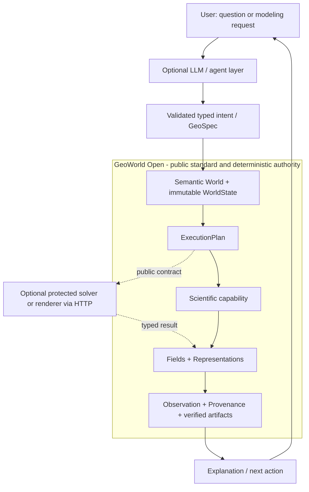

# GeoWorld Open

[](https://github.com/scifiss/geoworld-open/actions/workflows/ci.yml)
[](https://github.com/scifiss/geoworld-open/actions/workflows/secret-scan.yml)
[](LICENSE)
[](https://www.python.org/downloads/)

**GeoWorld Open is the executable standard, Python SDK, reference science, and benchmark suite for semantic geoscience Worlds.**

Try the one GeoWorld product: **[GeoWorld Studio](https://geoworld-studio.onrender.com/)**.

The broader GeoWorld system is LLM-assisted: an LLM can interpret intent, propose validated workflows, and explain results. GeoWorld Open is the deterministic authority beneath that layer. It defines typed state, capabilities, observations, Provenance, rendering requests, and reproducible artifacts.

> **LLMs may select, parameterize, and explain scientific workflows; deterministic scientific code performs the computation.**

GeoWorld Open runs independently. Protected GeoWorld capabilities may also implement these public contracts and be called through the optional HTTP SDK without exposing their source.


## What you can do

- use the public GeoWorld Studio client for authenticated Ask/Build and LAS Quicklook workflows;
- validate GeoSpec and the eight-concept World model;
- register and execute typed scientific capabilities;
- run five reproducible geoscience benchmarks;
- verify state transitions, Provenance, manifests, and artifact hashes;
- test a third-party implementation for GeoWorld conformance;
- construct renderer-neutral 2D, 3D, and 4D requests;
- optionally call an official protected capability over HTTP.

GeoWorld Studio keeps presentation and portable HTTP contracts public while protected
reasoning, knowledge, production science, persistence, and user data remain behind the
official service. Its sidebar reports the active capability-registry snapshot, and each
submitted job exposes a content-free correlation reference for diagnostics. Two synthetic
[LAS samples](examples/las/) are included for the measured-depth Quicklook workflow.

## Architecture



Agents act above the World; they are not a ninth kernel concept. Protected implementations never need to be imported by this package.

## Public standard

The frozen World Kernel is exactly:

| Concept | Contract |
|---|---|
| `World` | Validated aggregate and scientific scope |
| `Entity` | Persistent identity |
| `Relation` | Typed connection between entities |
| `Representation` | Immutable version-addressed computation artifact |
| `Field` | Typed scientific quantity and state binding |
| `WorldState` | Immutable state with temporal lineage |
| `Observation` | Evidence, distinct from state and truth |
| `Provenance` | Typed derivation inputs, outputs, methods, and lineage |

Standard 1.0 also defines:

- `CapabilitySpec`, `PhysicsCapability`, variables, units, assumptions, references, and `ValidityDomain`;
- append-only state-transition contracts;
- `RenderRequest` / `RenderSpec` for 2D, 3D, and 4D;
- artifact manifests and checksum verification;
- a renderer/solver-neutral [HTTP capability API](spec/v1/capability-api.yaml).

Read the concise [Standard 1.0 specification](spec/v1/README.md).

## Quickstart

```bash
git clone https://github.com/scifiss/geoworld-open.git
cd geoworld-open
python -m venv .venv
source .venv/bin/activate
python -m pip install -e .
```

Validate inputs and inspect benchmarks:

```bash
geoworld-open validate-geospec examples/scenarios/structural_multifault.yaml
geoworld-open benchmark-list
geoworld-open conformance-reference
```

Run and verify a benchmark:

```bash
geoworld-open benchmark-run seismic-avo --output runs/seismic-avo
geoworld-open verify-manifest runs/seismic-avo
```

Run the flagship semantic World:

```bash
geoworld-open flagship-run \
  examples/scenarios/flagship_faulted_reservoir.yaml \
  --output runs/flagship-world

geoworld-open validate-world runs/flagship-world/world.json
```

The optional local UI remains available with `python -m pip install -e '.[demo]'` and:

```bash
streamlit run apps/streamlit_app.py
```

## Implement a compatible capability

Implement the public protocol, publish a complete spec, and return a new dataset:

```python
from geoworld_open.reference import AcousticImpedanceReference
from geoworld_open.sdk import CapabilityRegistry
from geoworld_open.conformance import check_capability

capability = AcousticImpedanceReference()  # minimal textbook example
registry = CapabilityRegistry()
registry.register(capability)

report = check_capability(capability, representative_input_dataset)
assert report.conforms, report.issues
```

Third-party implementations may stay in another package or behind the HTTP API. Conformance validates declared dimensions, units, dtype families, deterministic behavior, output scope, and input immutability. Scientific suitability remains bounded by the declared validity domain.

## Benchmarks

| ID | Scope |
|---|---|
| `faulted-reservoir` | Faulted reservoir, immutable state change, Well evidence |
| `multi-fault-structure` | Fold plus normal and reverse faults |
| `seismic-avo` | Simplified public seismic/AVO reference |
| `co2-monitoring` | Explicit synthetic saturation change |
| `state-observation` | State, Observation, Representation, and Provenance |

The package also includes renderer-neutral benchmark requests for 2D, 3D, and 4D. `evaluate_reproducibility()` runs a case twice and checks exact arrays plus configurable numerical tolerances.

## Public SDK

Key modules:

- `geoworld_open.standard` — capability and render contracts;
- `geoworld_open.world` — World Kernel and transition contracts;
- `geoworld_open.sdk` — registry, serialization, loaders, verification, HTTP client;
- `geoworld_open.benchmarks` — packaged cases and numerical evaluation;
- `geoworld_open.conformance` — implementation compatibility checks;
- `geoworld_open.reference` — minimal transparent implementation examples.

The optional `ProtectedCapabilityClient` calls `/api/v1/capabilities/{id}/execute`. A missing or unavailable protected capability returns a clear structured/unavailable error; open capabilities continue to work independently.

## Public and protected boundary

| Public GeoWorld Open | Protected GeoWorld implementation |
|---|---|
| World, capability, render, transition, and artifact standards | Optimized and calibrated production implementations |
| SDK, conformance, benchmarks, reference science | Advanced physics, inversion/UQ, heavy 3D/4D rendering, GPU optimization |
| Renderer- and solver-neutral requests/results | Numerical method selection, coupling, stabilization, calibration |
| Reproducibility and integrity verification | Agents, prompts, RAG, accumulated knowledge, product intelligence |
| Public examples and expected outputs | Auth, jobs, persistence, user projects, operations, private evaluations |

The repositories are complementary layers of one GeoWorld product, not separate products and not a simple public/private code superset. See the audited [open-standard boundary](docs/open-standard-boundary.md).

## Scientific limitations

Public scenarios are synthetic educational and research benchmarks. They are not field inversion, calibrated reservoir simulation, history matching, production prediction, or engineering decision support. Public seismic/AVO uses a simplified linearized approximation. Applicability limits and assumptions are part of each contract and artifact bundle.

Read [Scientific Scope](docs/scientific-scope.md), [Derivations](docs/derivations.md), and [Limitations](docs/limitations.md).

## Verification

```bash
python -m compileall -q src apps scripts tests
python -m pytest -q
python scripts/scan_secrets.py
git diff --check
```

## Documentation and citation

- [Architecture](docs/architecture.md)
- [Standard 1.0](spec/v1/README.md)
- [World Kernel contracts](docs/world-kernel-contracts.md)
- [Flagship World walkthrough](docs/gate4-flagship-world.md)
- [Security](docs/security.md)
- [Citation metadata](CITATION.cff)
- [GeoWorld engineering blog](https://geoworld.hashnode.dev/)
- [scifiss on GitHub](https://github.com/scifiss)

## License

GeoWorld Open is licensed under the [Apache License 2.0](LICENSE). The license applies only to this repository and does not grant rights to the separate private GeoWorld implementation.
