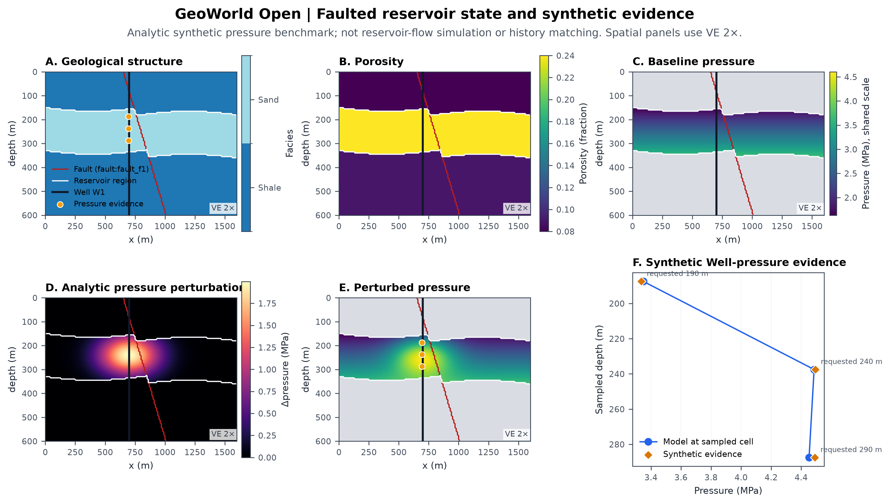
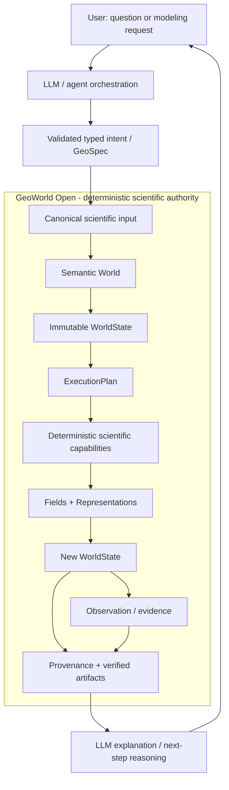
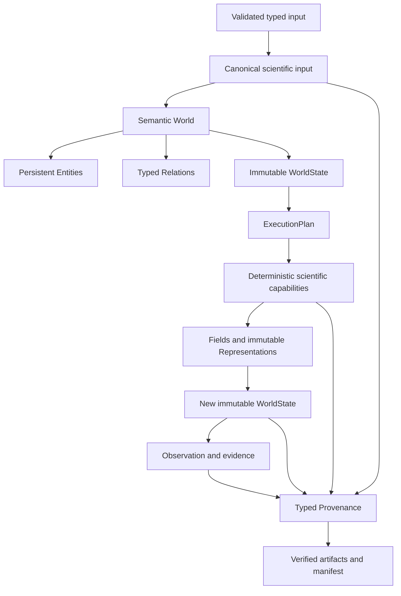

# GeoWorld Open

[](https://github.com/scifiss/geoworld-open/actions/workflows/ci.yml)
[](https://github.com/scifiss/geoworld-open/actions/workflows/secret-scan.yml)
[](LICENSE)
[](https://www.python.org/downloads/)

**GeoWorld Open is a deterministic semantic world-modeling framework for reproducible synthetic geoscience experiments.**

In the broader GeoWorld architecture, an LLM can interpret natural-language scientific intent, select and parameterize validated workflows, and explain results. GeoWorld Open provides the deterministic execution and state substrate beneath that layer: typed world state, scientific capabilities, observations, Provenance, and reproducible artifacts.

It separates scientific identity from numerical representation: a fault is not its mask, a reservoir region is not an array, and an observation is evidence rather than world state. Persistent entities and relations are connected to immutable `WorldState`, typed Fields and Representations, deterministic scientific capabilities, exact-input Provenance, and verified artifacts.

> **LLMs may select, parameterize, and explain scientific workflows; deterministic scientific code performs the computation.**

> **LLM optional by design.** GeoWorld Open can run completely standalone for reproducible scientific experiments. In the full GeoWorld system, an LLM/agent layer sits above this deterministic core to translate natural-language intent into validated actions and explain the resulting state and artifacts.

GeoWorld Open does not require an account, cloud service, or database. It exposes the deterministic scientific and world-model foundation in a bounded geoscience scope.



*A synthetic analytic benchmark connecting geological identity, immutable pressure states, and Well-pressure evidence. The Observation is evidence, not truth or state; the pressure perturbation is not reservoir-flow simulation or history matching.*

## Why GeoWorld Open

Many scientific pipelines collapse conceptual objects, numerical arrays, simulator state, and measurements into one data structure. GeoWorld Open keeps these meanings explicit:

- persistent entities and typed relations retain identity across computations;
- immutable states record how the modeled world changes;
- replaceable numerical Representations hold arrays without becoming their subjects;
- deterministic capabilities execute transparent scientific methods;
- Observations remain evidence linked to the state they sample;
- typed Provenance and content hashes make derivation inspectable;
- manifests verify the complete artifact boundary.

The framework is intentionally geoscience-first. It is not presented as a general AGI platform.

## Where the LLM fits

The broader GeoWorld system is LLM-assisted, with a strict validation and computation boundary. The LLM/agent layer is optional and is not implemented in this public repository.



### The LLM does

- understand natural-language requests and support scientific Q&A;
- select an appropriate workflow or scientific capability;
- propose parameters and typed inputs such as a GeoSpec;
- explain assumptions, results, limitations, and possible next actions;
- support iterative planning while remaining outside numerical authority.

### The LLM does not

- directly invent or execute numerical physics;
- bypass schema and input validation;
- become the authority for scientific arrays;
- silently modify immutable `WorldState`;
- replace deterministic scientific capabilities.

### Public and private layers

| Layer | Role | Repository |
|---|---|---|
| LLM / agent orchestration | Natural-language intent, Q&A, workflow selection, parameterization, and explanation | Private GeoWorld platform |
| Scientific contracts / World | Entity identity, relations, states, observations, and Provenance | `geoworld-open` |
| Deterministic scientific execution | Geology, scientific fields, synthetic experiments, and reproducible artifacts | `geoworld-open` |
| Product operations | Authentication, jobs, persistence, deployment, quotas, and production UX | Private GeoWorld platform |

## GeoWorld Studio

The [deployed GeoWorld Studio](https://geoworld-studio.onrender.com/) demonstrates the broader LLM-assisted workflow. Authenticated users can ask scientific questions or describe a model in natural language; GeoWorld interprets the request, prepares validated scientific inputs, executes deterministic modeling code, and returns assumptions, figures, artifacts, state, and Provenance.

GeoWorld Open is the public scientific foundation and architectural direction; the private production platform is being aligned with this World-centered foundation. This repository does not claim that every deployed production route already uses every current World Kernel module.

## Flagship world demonstration

The flagship scenario defines upper shale, reservoir sand, and lower shale with a fold and tilted normal fault. It adds a persistent `ReservoirRegion`, a Well, illustrative baseline pressure and temperature, an analytic pressure perturbation, a new immutable state at synthetic model time, and deterministic noisy Well-pressure evidence.

The example demonstrates semantic and reproducibility contracts. It is **not** reservoir simulation, pressure diffusion, history matching, field interpretation, or calibrated formation-pressure modeling.

- [Flagship faulted-reservoir scenario](examples/scenarios/flagship_faulted_reservoir.yaml)
- [Flagship World scientific walkthrough](docs/gate4-flagship-world.md)

## Deterministic World execution

This lower-level path shows where LLM authority ends. Once a proposed action crosses the validation boundary, canonical input and deterministic scientific code control execution:



The World-centered path is the architectural direction. The earlier operator workflow remains a supported, transparent seismic/AVO example rather than the definition of the whole project. See [Architecture](docs/architecture.md) for both execution paths.

## Core world concepts

The implemented kernel contains eight deliberately small concepts:

| Concept | Practical meaning |
|---|---|
| `World` | Aggregate that holds semantic registries and state history. |
| `Entity` | Persistent scientific identity, such as a Formation, Fault, Well, or ReservoirRegion. |
| `Relation` | Typed semantic connection between persistent entities. |
| `Representation` | Version-addressed computational depiction, such as an array, table, curve, or grid. |
| `Field` | Typed quantity or classification definition and its state-scoped numerical binding. |
| `WorldState` | Immutable assertion about the modeled world at an absolute or relative time. |
| `Observation` | Evidence acquired or synthesized about a subject or state, never state by default. |
| `Provenance` | Typed record of inputs, outputs, methods, parameters, and derivation lineage. |

In particular: `Entity != Field`, `Entity != Representation`, `Observation != WorldState`, and a semantic World is not a numerical array.

Deeper design material:

- [World-model foundations](docs/world-model-foundations.md)
- [Minimal World-Kernel architecture](docs/world-kernel-architecture.md)
- [Implemented World-Kernel contracts](docs/world-kernel-contracts.md)

## Quickstart

```bash
python -m venv .venv
source .venv/bin/activate
python -m pip install -e '.[dev,demo]'

geoworld-open flagship-run \
  examples/scenarios/flagship_faulted_reservoir.yaml \
  --output runs/flagship-world
```

The flagship run writes a complete reproducibility bundle. A useful human-facing subset is:

```text
runs/flagship-world/
├── flagship_public.png
├── flagship_diagnostic.png
├── report.md
├── assumptions.md
├── world_graph.json
├── state_lineage.json
├── observations/
│   └── well-pressure.csv
├── inputs/
│   └── flagship-input.json
└── manifest.json
```

Additional arrays, coordinates, Representation metadata, execution plans, traces, and Provenance records are retained for scientific inspection and verification.

## What gets produced

- normalized and content-bound scientific inputs;
- semantic World, entity/relation graph, and immutable state lineage;
- NumPy/xarray-compatible numerical artifacts and Representation descriptors;
- synthetic evidence with explicit seed lineage;
- assumptions, reports, diagnostics, and publication-oriented figures;
- typed Provenance and SHA-256 artifact manifests.

## Other runnable examples

These bounded transparent examples remain supported:

**Structural World**

```bash
geoworld-open world-run examples/scenarios/structural_multifault.yaml \
  --output runs/structural-world
```

**Layered reservoir with synthetic seismic and AVO**

```bash
geoworld-open run examples/scenarios/layered_reservoir.yaml \
  --output runs/layered-reservoir
```

**Synthetic CO2 monitoring change**

```bash
geoworld-open run examples/scenarios/co2_monitoring.yaml \
  --output runs/co2-monitoring
```

A standalone local demonstration is also available:

```bash
streamlit run apps/streamlit_app.py
```

## Visualization

The reusable visualization package provides semantic quantity styles, discrete facies palettes, zero-centered signed amplitudes, neutral missing values, explicit vertical exaggeration, overlays, export controls, and discoverable summary presets. The default summary is intentionally bounded rather than displaying every array.

Regenerate the committed hero through the supported flagship workflow:

```bash
geoworld-open flagship-run \
  examples/scenarios/flagship_faulted_reservoir.yaml \
  --output runs/flagship-world \
  --overwrite

cp runs/flagship-world/flagship_public.png \
  docs/assets/flagship_world_demo.png
```

The PNG is generated by the same approved visualization code used by normal artifacts; it is not manually retouched.

## Reproducibility

GeoWorld Open implements:

- canonical finite input serialization and exact input hashes;
- deterministic RNG namespaces and explicit seed lineage;
- immutable, version-addressed Representations with semantic content hashes;
- immutable `WorldState` ancestry;
- typed Provenance connecting scientific inputs, methods, states, and evidence;
- independent SHA-256 checksums for persisted artifacts;
- deterministic scientific outputs for identical code and inputs.

Runtime timestamps and timing measurements may vary because they are explicitly non-scientific metadata. Cross-platform byte identity is not claimed where libraries or rendering backends may encode artifacts differently.

## Scientific scope and limitations

The public scenarios are synthetic educational and research benchmarks with explicit or simplified parameters. They are not field-data inversion, calibrated reservoir models, pressure-diffusion solutions, history matching, production prediction, or engineering decision support. The public AVO example uses a simplified linearized Aki-Richards approximation.

Read [Scientific Scope](docs/scientific-scope.md), [Equation Derivations](docs/derivations.md), and [Limitations](docs/limitations.md) before adapting the methods.

## Public/private boundary

This public repository includes semantic World contracts, deterministic scientific examples, visualization, reproducibility and Provenance infrastructure, public scenarios, and tests.

The separate private GeoWorld platform may include production orchestration, agent policies and routing, prompts, RAG and knowledge assets, evaluation systems, deployment/authentication/database operations, advanced private scientific recipes, and product configuration. Those capabilities are not included here. See the contract-level [public/private boundary](docs/world-kernel-contracts.md#publicprivate-boundary).

## Tests

Run the complete local verification:

```bash
python -m compileall -q src apps scripts tests
python -m pytest -q
python scripts/scan_secrets.py
```

GitHub Actions repeats tests, compilation checks, the lightweight secret scan, and full-history Gitleaks scanning without requiring a live service.

## Documentation

- [Architecture and execution paths](docs/architecture.md)
- [World-model foundations](docs/world-model-foundations.md)
- [Minimal World-Kernel architecture](docs/world-kernel-architecture.md)
- [Implemented World-Kernel contracts](docs/world-kernel-contracts.md)
- [Structural science integration](docs/gate3-world-science-integration.md)
- [Flagship World demonstration](docs/gate4-flagship-world.md)
- [Equation derivations and references](docs/derivations.md)
- [Scientific scope](docs/scientific-scope.md)
- [Known limitations](docs/limitations.md)
- [Security design](docs/security.md)

## Links

- [GeoWorld live demo](https://geoworld-studio.onrender.com/)
- [GeoWorld engineering blog](https://geoworld.hashnode.dev/)
- [scifiss on GitHub](https://github.com/scifiss)

## License

GeoWorld Open is licensed under the [Apache License 2.0](LICENSE). The license applies only to this repository and does not grant rights to the separate private GeoWorld production platform.
