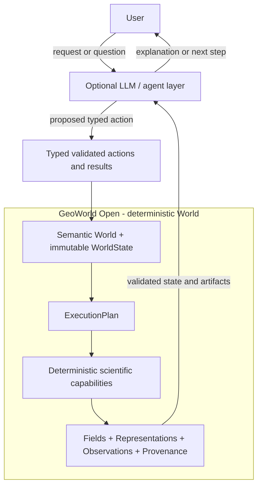

# Architecture

GeoWorld is an LLM-assisted scientific system with a deterministic authority boundary. The optional LLM/agent layer interprets requests, proposes typed actions, and explains results; GeoWorld Open validates and executes the public scientific computation beneath it.

GeoWorld Open contains two deterministic public execution paths. The World-centered path is the architectural direction; the ordered-operator path remains a bounded, transparent seismic/AVO example. Neither path requires an LLM or a service-to-service deployment. The local Streamlit demo and CLI call the same public Python packages.

It also defines an implementation-neutral standard boundary. A local plugin can implement `PhysicsCapability`, while a protected solver or renderer can implement the same declared input/output and result contracts over HTTP. In neither case does public code import protected source.

## System-level architecture



The LLM/agent layer shown above belongs to the separate private GeoWorld platform, not to this repository. It may understand natural-language intent, answer scientific questions, select workflows, propose parameters, and interpret outputs. It does not own numerical physics, bypass validation, or mutate World state directly.

Agents act **above** the World rather than becoming a ninth World Kernel concept:

```text
Agent perceives Observation
Agent maintains or uses estimated state and context
Agent selects an Action or workflow
Action invokes a deterministic capability through validated typed input
WorldState changes through an immutable transition
Observation provides new evidence
```

The implemented public kernel remains exactly `World`, `Entity`, `Relation`, `Representation`, `Field`, `WorldState`, `Observation`, and `Provenance`. Agent state, policies, prompts, routing, RAG, planning, and production orchestration remain outside the public kernel and outside this repository.

The private production platform is being aligned with this World-centered foundation. GeoWorld Open does not claim that every deployed production route already consumes every current World Kernel module.

## World-centered path

```text
Authored GeoSpec / scenario
        |
        v
CompiledInput with canonical serialization
        |
        v
Semantic World: persistent Entities + Relations + immutable WorldState
        |
        v
ExecutionPlan with explicit capability dependencies
        |
        v
Deterministic numerical capabilities
        |
        v
typed Field bindings + immutable/versioned Representations
        |
        v
new immutable WorldState
        |
        +--> Observation / evidence
        |
        v
typed Provenance + reports + arrays + verified manifest
```

### Authority flow

1. A geoscience-facing GeoSpec or scenario is validated and compiled exactly once.
2. Canonical finite serialization binds the complete scientific input to a content hash.
3. Persistent semantic objects enter a `World`; arrays do not replace their identity.
4. An `ExecutionPlan` orders registered deterministic capabilities and their typed variable contracts.
5. Capabilities produce numerical datasets without overwriting earlier scientific outputs.
6. Field bindings connect semantic quantities, subjects, Supports, states, and numerical Representations.
7. A transition appends a new immutable `WorldState`, Representation versions, and complete typed Provenance.
8. An `Observation` records evidence about a subject or state through its own Representation and lineage.
9. Artifact writers persist the World graph, inputs, arrays, reports, traces, checksums, and semantic Representation hashes.

The current structural path demonstrates analytic source-depth geometry, explicit stratigraphic assignment, persistent Formations/Faults, and immutable state transition. The flagship extends this with a persistent ReservoirRegion and Well, illustrative baseline fields, an analytic pressure change, a perturbed state, and synthetic pressure evidence.

This is a selective public scientific integration, not a claim that the separate private GeoWorld platform has been migrated in full.

## Legacy bounded workflows

```text
ScenarioSpec
    -> fixed ordered ScientificOperators
    -> WorkflowResult
    -> arrays, summary, report, trace, manifest
```

The legacy public workflow remains useful and supported. It validates explicit YAML parameters, generates layered/folded/faulted geometry, assigns explicit petrophysical and elastic properties, and computes simplified acoustic and AVO responses. Each operator is transparent, deterministic, and additive: it may create outputs but cannot silently overwrite previous arrays.

This path demonstrates a compact scientific pipeline. It does not provide persistent semantic identity or immutable World-state lineage, which is why it is no longer the complete architecture story.

## Shared design boundaries

Both execution paths follow the same public principles:

- deterministic scientific code owns computation;
- LLM use is optional and remains outside the numerical authority boundary;
- assumptions and applicability limits are explicit;
- observations are not automatically treated as state or truth;
- scientific arrays are not semantic entities;
- generated artifacts include inspectable lineage and checksums appropriate to their path;
- no production API, authentication, database, or private orchestration is required.

## Package map

- `src/geoworld_open/standard/` — versioned capability, validity-domain, and 2D/3D/4D render contracts.
- `src/geoworld_open/sdk/` — registration, serialization, artifact/World verification, and optional HTTP client.
- `src/geoworld_open/benchmarks/` — packaged scientific and render inputs plus reproducibility evaluation.
- `src/geoworld_open/conformance/` — checks for capabilities, Worlds, transitions, render results, and manifests.
- `src/geoworld_open/reference/` — minimal transparent examples needed to exercise the standard.
- `src/geoworld_open/world/` — eight-concept kernel contracts, reference integrity, immutable transitions, temporal values, and xarray Representation adapters.
- `src/geoworld_open/specs/` — typed geoscience authoring models used by the World-centered structural path.
- `src/geoworld_open/engine/` — capability registry, execution planning, variable contracts, and deterministic seed namespaces.
- `src/geoworld_open/domains/geoscience/structural/` — compiled structural input, analytic geometry, stratigraphic capabilities, World integration, and artifacts.
- `src/geoworld_open/domains/geoscience/flagship/` — bounded reservoir-region, Well, state-change, synthetic-evidence, diagnostics, and public-figure composition.
- `src/geoworld_open/viz/` — reusable quantity-aware styles, spatial plotting, overlays, panel presets, and deterministic export.
- `src/geoworld_open/operators/` — bounded legacy geology, properties, seismic, and AVO operators.

The top-level `schema.py`, `workflow.py`, and `artifacts.py` retain the compact legacy path. `cli.py` exposes `run`, `world-run`, and `flagship-run` without coupling the scientific packages to a UI.

## Semantic and numerical separation

The kernel deliberately distinguishes:

```text
Entity != Field
Entity != Representation
Observation != WorldState
semantic World != numerical dataset
```

For example, a Fault has persistent entity identity while `fault_selection` is a derived numerical Field represented on a grid. A Well is an Entity while its trajectory is a curve Representation. Pressure is a Field binding in a particular state; a sampled pressure table is an Observation Representation.

This separation permits multiple grids, tables, curves, or future representations of the same scientific subject without changing its identity.

## Reproducibility boundary

World-centered runs preserve:

- canonical input bytes and exact input SHA-256;
- immutable, version-addressed Representation lineage;
- semantic hashes over supported numerical content and metadata;
- immutable state ancestry and explicit relative/absolute time;
- deterministic RNG namespaces and seed lineage;
- typed Provenance with exact transition inputs and outputs;
- independent file checksums in the persisted manifest.

Legacy runs preserve normalized scenarios, seeds, operator versions, scientific arrays, traces, and artifact checksums. Runtime durations and timestamps are non-scientific metadata and may vary. The project does not make a blanket cross-platform byte-identity claim for rendered figures or library-dependent encodings.

## Visualization boundary

The visualization package consumes existing arrays and evidence records. It may mask missing values for display, convert units for labels, select normalization, and draw semantic overlays. It does not recompute fields, infer reservoir membership, mutate states, or alter Provenance.

Spatial plots use physical x/depth aspect by default or an explicit visibly labeled vertical exaggeration. Quantity styles distinguish categorical, sequential, positive-only, and signed data, and missing values receive a neutral color.

## Extension points

Public scientific extensions should:

- define explicit typed inputs and domain-owned semantics;
- register bounded capabilities with declared inputs and outputs;
- use the World contracts rather than treating arrays as identity;
- record applicability limits, methods, seeds, and Provenance;
- add outputs without mutating existing state or arrays;
- include deterministic numerical and semantic tests.

Domain ontologies, advanced physics, inference policy, agent orchestration, and product configuration are not responsibilities of the minimal kernel.

The normative public interface is summarized in [GeoWorld Open Standard 1.0](../spec/v1/README.md). The complete public/protected classification is recorded in [Open Standard and Protected Engine Boundary](open-standard-boundary.md).

## Further reading

- [World-model foundations](world-model-foundations.md)
- [Minimal World-Kernel architecture](world-kernel-architecture.md)
- [Implemented World-Kernel contracts](world-kernel-contracts.md)
- [Structural science integration](gate3-world-science-integration.md)
- [Flagship World demonstration](gate4-flagship-world.md)
- [Scientific scope](scientific-scope.md)
- [Limitations](limitations.md)
