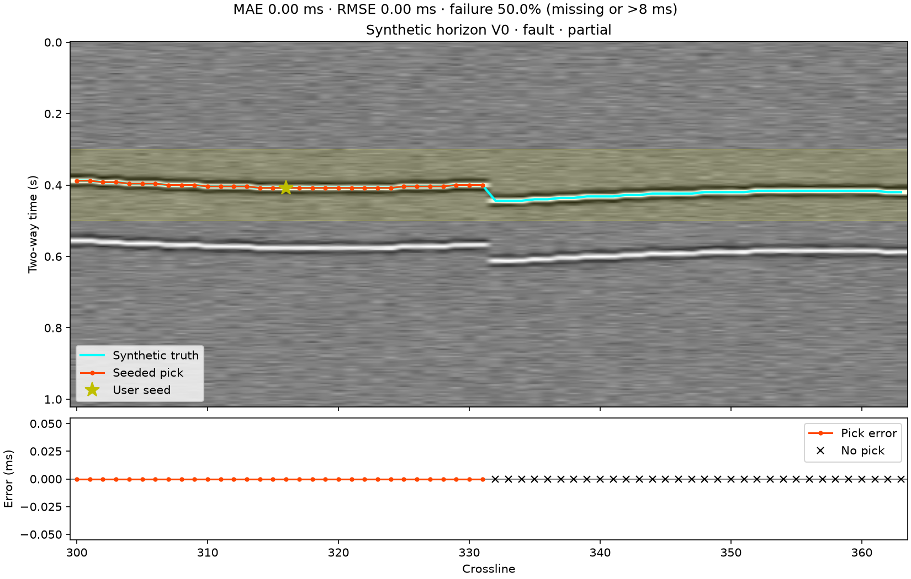

# Bounded synthetic horizon tracking V0

V0 follows one user-selected waveform event on an inline or crossline of a
GeoWorld-generated synthetic post-stack cube. It is a transparent reference
evaluation, not automatic interpretation or a field-data tracking capability.
Field SEG-Y/RSF viewing remains available in Seismic Explorer.

## Reproduce the benchmark

```bash
python -m geoworld_open.benchmarks.horizon runs/horizon-v0
pytest -q tests/test_horizon_reference.py tests/test_horizon_client.py tests/test_studio_horizon.py
```

The generator is `geoworld-horizon-synthetic-v0`, fixed seed `20261003`, with
24 inlines (1200–1223), 64 crosslines (300–363), 256 time samples, 4 ms sampling,
and 30 Hz Ricker wavelets. The primary horizon is the integer sample index
`round(94 + 5*sin(crossline_index/12) + 0.25*inline_index)`. A second positive
reflector lies 168 ms later. The fault case adds a 12-sample (48 ms) throw at
crossline index 32. Gaussian noise standard deviations are 0 (clean), 0.15
(noisy), 0.05 (fault), and 0.65 (stress), relative to unit wavelet peak.
These are analytic, uncalibrated convolutional synthetics, not wave-equation data.
The regular SEG-Y-compatible geometry is served in memory as format `synthetic`;
V0 does not export or alter a SEG-Y file.

## Baseline and bounds

The user supplies section direction/number, starting trace column, starting time,
and an ordered time window. The starting time rounds to the nearest sample and
must select a strong local extremum (at least 40% of the seed trace's window
maximum absolute amplitude). The polarity and mean-centered 11-sample seed
waveform remain fixed throughout propagation.

Walk independently in both directions. Search same-polarity extrema within the
time window and at most the configured jump from the last accepted pick (default
2 samples; allowed 1–8). Reject peaks below 30% of the seed amplitude or with
normalized seed-waveform correlation below 0.80. Rank remaining candidates by
correlation minus 0.03 per jumped sample; reject ambiguous winners with score
margin below 0.05. Stable ties resolve by earlier sample. Stop that direction at
the first failure, with no interpolation, reacquisition, or fault crossing.
Confidence is correlation times the capped peak-amplitude ratio, **not a
calibrated probability**; the user-selected seed has score 1.

Inputs are limited to 512 samples × 256 traces, a 129-sample window (at most
0.512 s), and 17 candidate positions per trace, each with an 11-sample template.
Windows require five source samples of waveform margin on each side of the
section. Waveform comparison may read those margins outside the pick window;
all returned picks stay inside the user-selected window. Runtime is bounded by
these input/operation limits rather than a nondeterministic timeout. A test covers
the largest supported section and search width with a 2 s local runtime guard.

## Recorded evaluation

Inline 1212, starting trace column 16, starting time 0.408 s, window 0.30–0.50 s,
maximum jump 2 samples. The seed is known for this reproducible evaluation;
Studio requires the user to enter a starting position explicitly.

| Case | Returned picks | MAE (ms) | RMSE (ms) | Failure rate |
| --- | ---: | ---: | ---: | ---: |
| Clean | 64/64 | 0 | 0 | 0% |
| Noisy | 20/64 | 0 | 0 | 68.75% |
| Fault | 32/64 | 0 | 0 | 50% |
| Stress | 1/64 (seed only) | 0 | 0 | 98.4375% |

MAE/RMSE describe **returned picks only**, including the seed. Failure rate uses
all section traces: an absent pick or absolute error above 8 ms is a failure.
Low MAE with low coverage is not successful tracking. A wrong-event test seeds
the secondary reflector: the tracker follows that event without consulting
truth, producing 168 ms MAE and 100% evaluation failure. Clean zero errors reflect
integer-sampled truth and matching wavelets, not demonstrated field accuracy.
Measured tracking plus evaluation/result construction takes approximately 1–5 ms
per reference section on the local test host; generation/rendering are excluded.



The [machine-readable summary](assets/horizon-v0-summary.json) includes complete
generator parameters, source SHA-256 digests, metrics and measured runtimes.
The runner also saves each derived pick, error, confidence and failure reason as
JSON, and one `evaluation.png` figure for the discontinuity case.

## HTTP and Seismic Explorer

- `GET /seismic/horizons/benchmarks`: authenticated catalog of four built-in
  generated datasets, separate from configured and privately uploaded field data.
- `POST /seismic/view`: existing view route also serves those synthetic identities;
  inline/crossline sections only, with bounded output.
- `POST /seismic/horizons/track`: authenticated `HorizonTrackRequest` to
  `HorizonTrackResult`. Dataset identity must be in the server's generated registry.
  Uploads, field data, metadata labels and supplied paths cannot opt into V0.

Example request (use the actual dataset ID from the benchmark catalog):

```json
{
  "dataset_id": "<24-character synthetic dataset ID>",
  "view_kind": "inline",
  "section_number": 1212,
  "seed_trace": 16,
  "seed_time_s": 0.408,
  "window_start_s": 0.30,
  "window_stop_s": 0.50,
  "max_jump_samples": 2
}
```

Tracking never receives truth. A separate evaluator joins its result to the
generated horizon truth. The derived response records the full request, generator
seed/parameters, source and section hashes, algorithm version/thresholds,
evaluation definition, and unchanged-source/derived-result flags. Samples and
truth arrays are read-only; tests also check writable source arrays are unchanged.
No source database record or seismic samples are overwritten.

Studio offers section selection, explicit seed/time-window/jump controls, a truth
and pick overlay with errors/missing picks, metrics, confidence/failure details,
and a downloadable derived JSON result. Changing section, dataset or tracking
parameters clears stale results. Field datasets have no tracking action. The
frontend remains HTTP-only; it does not import private backend code.

## Limits and deferred work

V0 assumes a strong, coherent same-polarity event on regular time-sampled data.
No sub-sample estimation, phase/polarity change handling, fault crossing, missing
trace recovery, calibrated uncertainty, automatic event selection, denoising or
field validation is provided. Moderate and severe noise cause conservative stops.
The result is downloadable rather than persisted in a project interpretation store.
The public reference package commit must be published before installing the
backend's updated pinned dependency; local validation uses the sibling checkout.
No deployment is performed.

Denoising, multiwell correlation/log-to-property, well-seismic tie, and integration
with local RTM/FWI remain separate future tasks.
