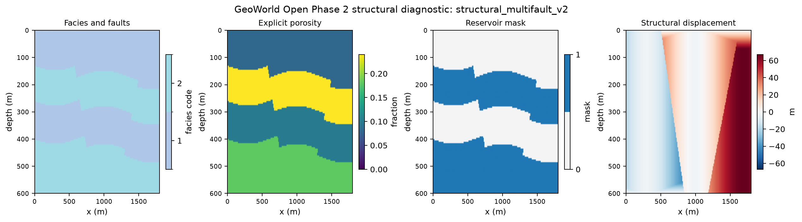

# Phase 2 Scientific Foundation

Phase 2 establishes a coordinate-aware structural foundation. It does not compute
elastic properties, fluids, rock physics, seismic, AVO, uncertainty, or AI outputs.



## Dataset conventions

The scientific boundary is an `xarray.Dataset`. Structural fields use dimensions
`(depth, x)` with cell-center coordinates in metres. Depth is positive down.
Categorical facies use explicit integer codes and `flag_values`/`flag_meanings`
metadata. Reservoir, fault-side, and boundary-clipping states are Boolean masks.

Reserved coordinate conventions support later datasets without implementing their
physics:

| Domain | Dimensions |
|---|---|
| Earth model | `(depth, x)` |
| Baseline/monitor Earth model | `(vintage, depth, x)` |
| Seismic | `(vintage, time, x)` |
| Angle-domain seismic | `(vintage, angle, time, x)` |
| Ensemble Earth model | `(realization, vintage, depth, x)` |

Phase 4 may add `two_way_time_s(vintage, depth, x)`. This auxiliary mapping must
be retained even when reflectivity is resampled onto a shared uniform `time`
coordinate for convolution.

Every scientific variable carries `units`, `long_name`, `physical_meaning`,
`method_id`, and `source_operator`. NumPy arrays remain valid inside numerical
kernels, while xarray defines operator inputs and outputs.

## GeoSpec V2

GeoSpec V2 contains only Phase 2 concepts: metadata, seed, grid, facies, layers,
listed structures, structural method, outputs, and assumptions. Layers reference
explicit facies IDs and provide explicit thickness, porosity, and reservoir status. No lithology
recipe or intelligent default derives porosity or any later physical property.

Future mineral, fluid, dry-frame, rock-physics, seismic, AVO, experiment, and
uncertainty sections will be added only with their implementing operators.

## Coordinate and structural conventions

- `x` increases toward positive x, displayed to the right.
- `depth` increases downward from `depth_origin_m`.
- Grid coordinates identify cell centers; grid width and thickness describe cell edges.
- Fold displacement is positive downward and sinusoidal in x.
- Fault dip is an acute angle from horizontal toward increasing depth.
- `dip_direction` selects whether the trace moves toward positive or negative x with depth.
- `displaced_side` explicitly identifies which side receives the throw.
- A normal displacement moves selected material downward; reverse moves it upward.
- Structures are applied in their GeoSpec list order through source-depth mapping.
- A fault is evaluated against the source-depth state produced by preceding structures.
- Source depths crossing model boundaries are clipped and recorded in
  `boundary_clipped_mask`; clipping is never hidden.

The source-depth mapping is:

```text
facies_at_output_cell = undeformed_stratigraphy(source_depth_at_output_cell)
```

This produces transparent analytic synthetic geometry. It is not mechanical
deformation, restoration, fault-damage modeling, or a geological prior.

## Graph and randomness

The V2 engine compiles a small scientific DAG from typed contracts. It detects
cycles, missing dependencies, missing producers, conflicting producers, and
dimension/unit mismatches. It is not a production scheduler.

A root `numpy.random.SeedSequence` is derived from the GeoSpec seed. Operator and
future realization generators use stable SHA-256 namespace words in the spawn key,
so their identity does not depend on graph traversal order. Seed lineage is written
to provenance. No operator uses NumPy global RNG state.

## Compatibility

Existing V1 scenarios retain their original V1 runner and artifacts. The optional
V1-to-V2 migration maps only explicit geometry, facies, and porosity and is labeled
`v1_structural_only`. V1 Vp, Vs, density, CO2 multipliers, seismic, and AVO inputs
are not reinterpreted as V2 science.
