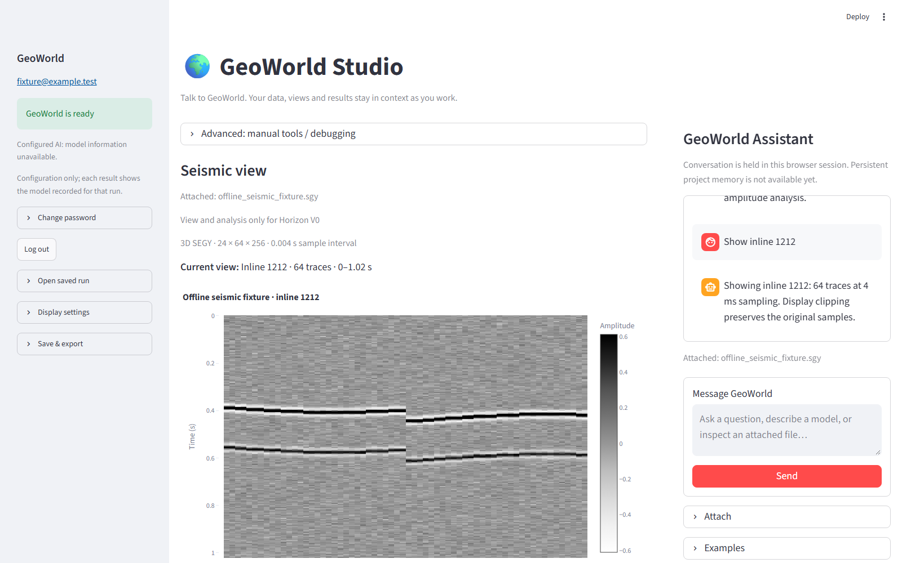
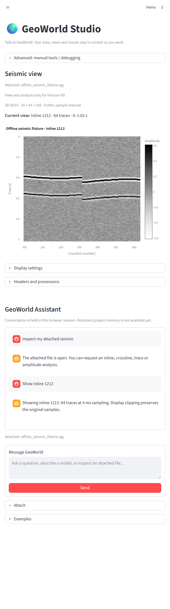

# One GeoWorld Assistant

Studio now presents one assistant and a contextual workspace. The public frontend
continues to call the authenticated backend for capability selection; no new LLM,
routing policy, storage layer or scientific implementation is introduced.

## Interaction flow

| Before | After |
| --- | --- |
| Choose Ask or Build / Seismic Explorer, then find its input | Send a request to GeoWorld Assistant; the backend decision changes the main workspace |
| Change to a separate seismic chat | Use the same composer for seismic commands, questions, model requests and LAS entry |
| Select user data and Horizon V0 fixtures in one Dataset dropdown | Attach a file as context; open synthetic benchmarks explicitly under Examples |
| Add a SEG-Y dataset in the seismic panel | Open Attach beside the shared composer, select SEG-Y and attach the validated result |
| Raw unavailable-upload warning | “A previously uploaded seismic file is no longer available. Reattach it to continue.” |

On desktop, the main workspace stays on the left and GeoWorld Assistant stays on
the right. Below 900 px, the assistant stacks beneath the workspace. The history
scrolls separately and the composer remains at the bottom of the assistant panel.
Manual compatibility controls remain in Advanced, collapsed until explicitly used.

## Context and history

Attaching uses the existing secure upload/validation API and its returned dataset
identity. Failed validation preserves the previous context. Switching between
multiple user/configured files is a collapsed contextual action; benchmark cases
are never added to that list. Example discovery calls the existing benchmark
catalog only after the explicit Examples action.

The UI adapts SeismicExplorerState.visible_history and existing completed job
answers to one session conversation. Display reruns do not append duplicate turns,
repeat interpretation or submit jobs. Unsent edits leave the accepted workspace
visible. Reopening a saved job changes the active workspace without executing it.
Session conversation and attachment state are cleared on logout. This is not
durable project/thread memory, and requests retain the existing backend context
contracts; the UI does not add cross-capability reasoning memory.

Original unavailable-upload warnings remain in client logs and the session's
catalog diagnostics, and are shown in provenance when a view is available.
Reattachment is required if ephemeral backend storage has lost the source file.

Scientific preparation/approval controls, source samples, Horizon V0 picking and
truth evaluation, field restrictions, LAS, RTM/FWI and service boundaries retain
their existing behavior.

## Evidence

The screenshots use the real Studio app with an offline HTTP double. Its attached
SEG-Y filename and conversation are test fixtures; the plotted samples come from
the existing public synthetic benchmark. No live account, field file or scientific
job was used. Reproduce with:

```bash
streamlit run tests/fixtures/assistant_capture_app.py
pytest -q tests/test_studio_assistant.py tests/test_studio_request.py tests/test_studio_seismic.py tests/test_studio_horizon.py
```

Wide view (1600 px):



Narrow view (700 px):



The [browser layout measurements](assets/studio-assistant-layout.json) record one
composer at both widths, desktop placement to the right, narrow placement below
the workspace, and no horizontal document overflow. Captured with local Edge
DevTools after Streamlit finished rendering; no deployment was used.

## Current limits

Conversation is session-only and the existing backend determines supported
language/context. Synthetic Horizon V0 still uses explicit seed/window controls.
SEG-Y attachment is supported here; LAS retains its existing contextual upload
controls after the assistant routes a LAS request. Small screens require scrolling
past the active view to reach the assistant. No persistent project memory or new
interpretation storage is added.

## Files changed

In geoworld-open:

- UI: `apps/studio_streamlit.py`; `src/geoworld_open/studio_assistant.py`;
  `src/geoworld_open/studio_request.py`; `src/geoworld_open/studio_seismic.py`.
- Tests: `tests/test_studio_assistant.py`; `tests/test_studio_request.py`;
  `tests/test_studio_seismic.py`; `tests/test_studio_horizon.py`;
  `tests/test_studio_presentation_app.py`; `tests/test_studio_presentation_browser.py`;
  `tests/test_studio_fwi.py` (composer selectors only).
- Fixtures: `tests/fixtures/assistant_capture_app.py`;
  `tests/fixtures/studio_capture_app.py`; `tests/fixtures/seismic_explorer_app.py`;
  `tests/fixtures/horizon_explorer_app.py`; `tests/fixtures/horizon_workspace_capture.py`.
- Docs: this report; `docs/studio-request-client.md`;
  `docs/seismic-explorer-client.md`; `docs/studio-screenshots.md`;
  `docs/assets/studio-assistant-wide.png`; `docs/assets/studio-assistant-narrow.png`;
  `docs/assets/studio-assistant-layout.json`.

In geoworld: `pyproject.toml` pins the corresponding public UI commit.
