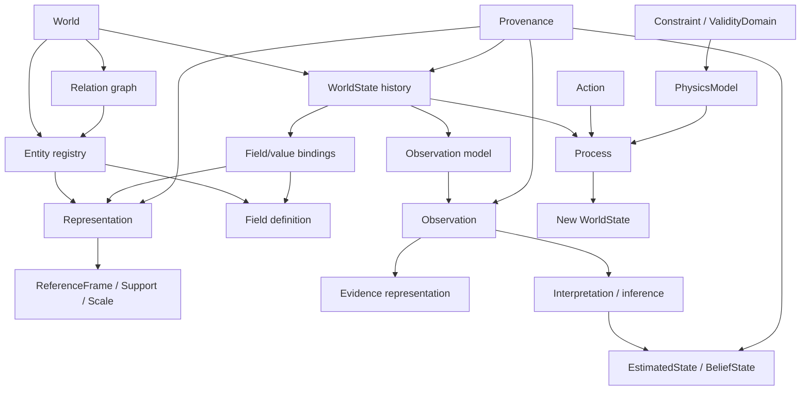

# Phase 1.5 Universal World-Kernel Architecture

## Status and decision

This document is a design specification, not an implementation contract. It
refines [World-Model Foundations](world-model-foundations.md) and governs the
next architecture review before the unmerged Phase 2 scientific foundation is
integrated.

The design objective is:

> **Small universal foundation, deep geoscience domain.**

The release boundary is:

> **Expose the architecture. Protect the intelligence.**

The kernel must represent identity, evidence, state, and representation without
knowing the detailed semantics of a reservoir, heart, or robot. Domain packages
provide those semantics.

## 1. Minimal universal kernel

Only eight concepts belong in the minimal identity/evidence kernel.

| Concept | Meaning | Identity | Time dependence | Numerical relationship |
|---|---|---|---|---|
| `World` | Aggregate containing registries and state history | Persistent world ID | Owns a sequence/graph of states | Does not equal a dataset |
| `Entity` | Persistent semantic subject | Stable entity ID independent of data | Persists across states | May reference representations and fields |
| `Relation` | Typed edge between subjects | Stable relation ID when the relation itself is tracked | May have a validity interval | Topology may be represented numerically but is not the edge |
| `WorldState` | Immutable assertion about a world at a time/interval | State ID plus parent/derivation lineage | Intrinsically time-scoped | Binds entities/relations to values and representations |
| `Field` | Semantic definition and state binding for a quantity/classification | Stable field-definition ID; value bindings are state-scoped | Static or dynamic | Values live in a representation such as xarray |
| `Representation` | Replaceable computational depiction of a subject or field | Representation ID | Static, state-scoped, or versioned | Owns/references arrays, meshes, graphs, images, or latent data |
| `Observation` | Evidence produced about a subject/state | Observation ID | Has acquisition/valid time | Data are held by an observation representation |
| `Provenance` | Derivation and source lineage | Record/event IDs | Records event time and valid lineage | References inputs, outputs, methods, and artifacts |

These concepts are deliberately weak semantically. For example, the kernel can
store a relation type identifier but does not decide whether a fault may
`INTERSECT` a formation. That rule belongs to geoscience.

### Adjacent generic layers

The following concepts are important but should not inflate the minimal kernel.

| Layer | Generic concepts | Why it is outside the minimal kernel |
|---|---|---|
| Spatial | `ReferenceFrame`, `Support`, `Geometry`, `Topology`, `CoordinateTransform`, `Scale` | Needed only by spatial representations |
| Dynamics | `Process`, `Action`, `Constraint` | Describes transition/intervention, not identity |
| Epistemic | `Interpretation`, `EstimatedState`, `BeliefState`, `Uncertainty` | Describes knowledge about a world, not the world itself |
| Physics | `PhysicsModel`, laws, conditions, couplings, `ValidityDomain` | Scientific model contracts and domain content |
| Planning | `Agent`, `Goal`, `Plan`, policy/evaluator contracts | Sits above world and epistemic layers |

`Component` is not a universal base class. Composition is an implementation
principle: domain packages may attach typed components to entities without a
kernel-wide component taxonomy.

### Candidate concept disposition

The requested candidates are not accepted as one flat ontology. Their explicit
disposition is:

| Candidate | Decision | Placement or replacement |
|---|---|---|
| `World` | ACCEPT | Minimal kernel aggregate and registry boundary |
| `Entity` | ACCEPT | Minimal kernel persistent subject identity |
| `Relation` | ACCEPT | Minimal kernel typed semantic edge |
| `Representation` | ACCEPT | Minimal kernel separation between a subject and its computational depiction |
| `ReferenceFrame` | REPOSITION | Generic spatial layer; worlds without spatial coordinates do not require it |
| `SpatialSupport` | REPOSITION/RENAME | Generic spatial layer as the spatial specialization of `Support` |
| `State` | ACCEPT AS `WorldState` | Minimal kernel immutable, time-scoped world assertion; avoid an unqualified mutable `State` |
| `Field` | ACCEPT | Minimal kernel semantic quantity/classification definition and binding |
| `Observation` | ACCEPT | Minimal kernel evidence record, distinct from state |
| `Process` | REPOSITION | Generic dynamics layer |
| `Action` | REPOSITION | Generic dynamics/intervention layer |
| `Agent` | REPOSITION | Planning layer; an agent's physical body may separately be an Entity |
| `Goal` | REPOSITION | Planning layer |
| `PhysicsModel` | REPOSITION | Generic scientific-model layer |
| `Scale` | REPOSITION | Cross-cutting spatial/temporal representation metadata |
| `Uncertainty` | REPOSITION | Epistemic metadata/representation, attached through typed contracts |
| `Provenance` | ACCEPT | Minimal kernel derivation and source lineage |
| `Interpretation` | REPOSITION | Epistemic layer between evidence and estimated belief |
| `Constraint` | REPOSITION | Generic dynamics/science contract; its rules are domain-owned |
| `BalanceLaw` | REPOSITION | Scientific-model descriptor; domain implementations supply equations |
| `ConstitutiveLaw` | REPOSITION | Scientific-model closure contract; domain-owned semantics |
| `BoundaryCondition` | REPOSITION | Scientific-model condition contract |
| `InterfaceCondition` | REPOSITION | Scientific-model condition contract |
| `Coupling` | REPOSITION | Scientific-model composition contract |
| `ValidityDomain` | REPOSITION | Scientific-model applicability contract and explicit metadata |
| `BeliefState` | REPOSITION | Epistemic layer; may have ensemble, distribution, interval, or other representations |

`SpatialSupport` is therefore not discarded, but it is not the universal name:
the generic contract is `Support`, with spatial support as one specialization.
No candidate is promoted merely because it is useful in geoscience.

## 2. Semantic graph

The instantiated world is a typed graph with registries, not an inheritance tree.



Key rules:

1. Entities do not contain raw coordinates as identity attributes.
2. A Field is not an Entity and a Representation is not its subject.
3. WorldState is an immutable assertion/snapshot, not a mutable bag of arrays.
4. Observation is evidence, never an automatic replacement for state.
5. EstimatedState and BeliefState preserve their inferential status.
6. Processes transition states; actions request or parameterize interventions.
7. Agents consume observations/beliefs and propose actions but do not define the world.

## 3. Spatial and coordinate model

### ReferenceFrame

A reference frame supplies coordinate meaning, not merely axis names. A minimal
frame descriptor should be able to identify:

- frame ID and frame type;
- axes, units, order, handedness, and positive directions;
- datum/origin where applicable;
- optional parent frame;
- transform reference and provenance;
- valid spatial and temporal domain.

Examples are a global projected frame, fault-local strike/dip/normal frame,
well measured-depth frame, true-vertical-depth frame, scanner frame, robot base
frame, and tool frame.

### CoordinateTransform

A transform is a versioned directed mapping between frames. It declares its
domain, dimensionality, invertibility status, expected accuracy/uncertainty,
method, and provenance. The architecture must not assume every transform is
analytic, exact, globally valid, or invertible.

### Support and SpatialSupport

`Support` identifies where values or geometry are defined. Spatial support may be
a point set, curve, surface, volume, grid cells, mesh elements, voxel region, or
another explicit domain. Temporal and categorical supports are also possible.

Support is distinct from resolution. Two representations may cover the same
support at different resolutions.

### Geometry, topology, and representation

Geometry gives shape/position in a reference frame. Topology gives connectivity,
adjacency, containment, and incidence. Both are represented through a
`Representation`; neither should be embedded directly into `Entity` identity.

A representation descriptor should include:

```text
representation_id
subject references
representation kind
reference frame
support
topology reference
resolution / scale
artifact or in-memory data reference
state/valid-time scope
provenance
```

Supported kinds are extensible domain identifiers rather than a closed universal
enumeration. Public examples may include point, curve, surface, regular grid,
unstructured mesh, voxel volume, graph, image, point cloud, and learned latent
representation.

### Material and occupancy

A material such as CO2 has composition and properties but no necessary intrinsic
world position. Location belongs to a state-scoped occupancy relation/binding:

```text
FluidMaterial(CO2)
FluidOccupancy(
    material=CO2,
    host=Formation_A,
    support=Region_R1,
    saturation_field=FieldBinding(...),
)
```

`FluidMaterial` is a geoscience/material-domain entity. `FluidOccupancy` is a
domain state component or qualified relation, not a universal kernel class.

## 4. State semantics

### Persistent identity versus state

Persistent records include entities, durable relation identities, field
definitions, reference frames, and representation identities. State-scoped
records include field values, occupancy, active contacts, pressure, saturation,
stress, pose, velocity, and other conditions.

Static properties are simply bindings whose validity spans the modeled interval;
they should not require a separate ontological category. Dynamic properties have
shorter validity or are present in multiple states.

### WorldState

A `WorldState` should contain or reference:

- `state_id`, world ID, valid time/interval, and parent/derivation IDs;
- entity/relation validity or changes relative to a parent;
- scalar and Field value bindings;
- state-scoped Representation references;
- assumptions, constraints, uncertainty status, and provenance.

The state may use immutable structural sharing or deltas, but public interfaces
must present a complete resolved view. It should not be defined as exactly one
`xarray.Dataset`.

### Fields and arrays

A Field definition states quantity/classification semantics, units, value kind,
physical rank where applicable, admissible supports, and missingness policy. A
Field binding connects that definition to a subject, state, support, and
representation containing values.

Physical tensor semantics are explicit metadata:

- scalar, vector, covector, or tensor rank;
- basis/reference frame;
- component labels;
- transformation law and symmetry where relevant.

These are separate from an N-dimensional array's storage dimensions. For example,
`seismic[x, y, time, angle, vintage]` is a multiway array but is not thereby a
physical tensor. A stress field is a physical second-rank tensor even when its
storage is a six-component compressed array.

### Spec decomposition

One giant GeoSpec should not remain the fundamental abstraction.

| Specification | Responsibility |
|---|---|
| `WorldSpec` | Persistent entities, relations, reference frames, and representation declarations |
| `StateSpec` | Initial/state-specific values, Field bindings, occupancy, time, and constraints |
| `ObservationSpec` | Sensor/acquisition design, observed subjects/support, noise/missingness assumptions |
| `ExperimentSpec` | Question, compared states, interventions, observations, outputs, and acceptance metrics |
| `ExecutionPlan` | Compiled capabilities, dependencies, data movement, seeds, and requested artifacts |

`GeoSpec` may remain a geoscience-facing convenience document that compiles into
these contracts. It must not be the universal world kernel or execution plan.

## 5. Physics abstraction

`PhysicsModel` belongs to a generic scientific-model layer. The universal kernel
only needs stable references to the process/model that derived a state.

A physics-model contract may declare:

```text
model ID and version
state variables and supports
governing law references
conserved quantities
constitutive laws
initial/boundary/interface conditions
source and sink terms
couplings
applicable scales
assumptions and ValidityDomain
evaluator/solver capability
diagnostics and residuals
```

The contract must support analytical evaluators, numerical solvers, external
simulators, surrogates, and learned models without treating them as scientifically
equivalent.

### BalanceLaw

`BalanceLaw` is useful as a model descriptor/category, not as a universal scalar
PDE base class. It may identify accumulation, transport/flux, and source terms,
but must support differential, integral, algebraic, vector, tensor, and discrete
forms. Mass, species, energy, momentum, and charge laws are domain implementations.

### ConstitutiveLaw

Constitutive laws are separate from balances. They close or relate state variables
and material response. Darcy flow, elasticity, friction, relative permeability,
capillary pressure, equations of state, reaction kinetics, and rock physics live
in domain science packages.

### Conditions and coupling

`BoundaryCondition` and `InterfaceCondition` are typed constraints applied to a
model/support. `Coupling` declares exchanged quantities, directionality,
time/scale semantics, and consistency strategy between models. These contracts
belong beside PhysicsModel, not in Entity.

### Constraint and validity

A generic `Constraint` contract is valuable because it supports schema validation,
scientific checks, inference, and planning. It declares subjects, expression or
evaluator reference, tolerance, severity, and provenance. Domain packages supply
actual constraints such as saturation closure or well/formation intersection.

`ValidityDomain` declares assumptions, required variable/support semantics,
parameter ranges, scales, excluded regimes, and applicability checks. Public code
may expose explicit rules for published methods; private automatic applicability
selection remains private.

## 6. Multiscale architecture

`Scale` is a cross-cutting value object rather than an Entity. It describes:

- spatial support and characteristic resolution;
- temporal support and resolution;
- sampling/averaging window;
- measurement or effective-property semantics;
- validity range and provenance.

Pore-, core-, log-, seismic-, reservoir-grid-, field-, and basin-scale porosity
may share a quantity name while differing in support and averaging semantics.

`UpscalingOperator`, `DownscalingOperator`, `HomogenizationOperator`,
`RestrictionOperator`, and `ProlongationOperator` are execution capabilities.
Their outputs must record source and target support/scale, method, assumptions,
loss of information, uncertainty, and lineage. They do not belong in the kernel.

`ScalingLaw`, fractal, and multifractal models remain optional domain science.
The kernel supports them through ordinary model, scale, and provenance contracts.

## 7. Observation, interpretation, estimate, and belief

The architecture distinguishes five epistemic layers:

| Layer | Meaning |
|---|---|
| Asserted/hypothetical `WorldState` | A model assertion; synthetic cases may designate it as truth |
| `Observation` | Evidence generated or measured from a state/subject |
| `Interpretation` | Semantic claim linking evidence to entities, regions, or hypotheses |
| `EstimatedState` | Inferred state with method, evidence, uncertainty, and validation lineage |
| `BeliefState` | Distribution, weighted hypotheses, ensemble, or another uncertainty representation over estimates |

Real-world `WorldState` must not be casually labeled truth. The system can know an
asserted model and evidence; epistemic status is explicit.

Tensor completion and imputation are inference operators. Their outputs preserve
observed and estimated masks, input observations, method, assumptions,
uncertainty, validation metrics, and provenance. Estimated samples never overwrite
or become indistinguishable from observed samples.

An ensemble is one representation of a BeliefState, not the definition of belief
itself. Other future representations may include parametric distributions,
particles, intervals, or learned posterior forms.

## 8. Agent and scientific-planning loop

Agent, Goal, Plan, and policy contracts belong in a planning layer above the world.
An embodied agent may also have an Entity representing its physical body, but the
decision-making contract remains separate.

```text
WorldState
    -> ObservationOperator
    -> Observation
    -> Interpretation / BeliefUpdate
    -> BeliefState
    -> Planner(Goal, Constraints, BeliefState)
    -> proposed Action
    -> action validation / applicability
    -> Process or PhysicsModel
    -> new WorldState
```

Scientific planning selects experiments, models, observations, and actions. It
does not bypass schema, constraint, applicability, provenance, or deterministic
execution boundaries. An LLM may propose a plan but cannot redefine physical
state or mark estimates as observations.

## 9. Cross-industry sanity test

| Concept | Faulted reservoir | Beating heart | Robot manipulating object |
|---|---|---|---|
| Entities | formations, fault, well, fluid material | patient, heart, chambers, tissue, device | robot, links, gripper, object, table |
| Relations | intersects, bounded-by, penetrates, occupies | part-of, connected-to, perfused-by | part-of, contacts, supports, grasps |
| Representations | horizons, fault surface, grids, well trajectory | anatomy mesh, segmentation, images | meshes, kinematic tree, point cloud |
| Frames/supports | survey, depth, fault-local, well MD/TVD | patient/scanner/anatomical frames | world, base, joint, tool, camera frames |
| Fields/state | facies, pressure, saturation, stress | pressure, flow, electrical potential, strain | pose, velocity, contact force, occupancy |
| Observations | seismic, logs, pressure, production | ECG, MRI, ultrasound, pressure | cameras, encoders, force/torque |
| Processes | deformation, flow, waves | electrophysiology, contraction, blood flow | rigid-body dynamics, contact |
| Actions | drill, inject, produce | pace, administer drug, procedure | move, apply torque, grasp |
| Agent/goal | scientist/operator; monitor storage | clinician/controller; stabilize function | controller; place object safely |

The kernel concepts do not change. Domain packages define entity types, relation
rules, fields, models, constraints, observations, actions, and validity knowledge.
This passes the central test without claiming the kernel understands any domain.

## 10. Non-goals

- No universal ontology of all physical concepts.
- No speculative general-relativity or quantum abstractions.
- No built-in geoscience property catalog or relation intelligence.
- No requirement that every world use space, continuous time, or PDE physics.
- No assumption that xarray, meshes, or learned tensors are the world itself.
- No agent authority to mutate evidence or bypass scientific validation.
- No implementation in Phase 1.5.
