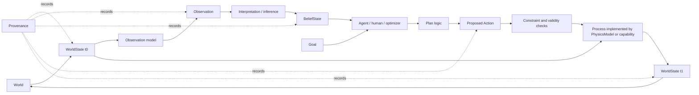
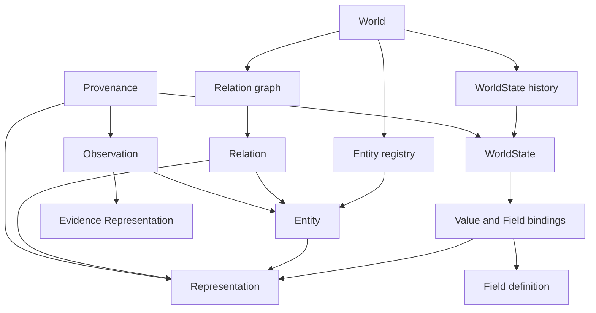

# Release Gate 1: World-Kernel Architecture Decision

## Decision status

**Status:** ready for architecture review; no implementation is authorized.

This is the canonical Gate 1 decision record. The earlier
[world-kernel architecture](world-kernel-architecture.md) and
[migration boundary](world-kernel-migration-boundary.md) documents remain
supporting analysis. This decision is governed by:

> **Small universal foundation. Deep domain implementation.**

> **Expose the architecture. Protect the intelligence.**

The kernel represents what exists, identity through change, state, numerical
representation, evidence, and derivation. Optional generic layers add space,
dynamics, epistemics, physics, scale, and planning. Domain packages supply all
scientific meaning, rules, methods, and calibrated intelligence.

## A. Final minimal kernel

The universal kernel contains exactly eight major concepts.

| Concept | Meaning | Universal? | Persistent? | Time-varying? | Numerical representation | Why needed |
|---|---|---:|---:|---:|---|---|
| `World` | Registry/graph boundary for identities and state history | Yes | Yes | Its referenced state history evolves | None required | Without it, identities, relations, and states have no coherent scope |
| `Entity` | Stable semantic subject that can persist through change | Yes | Yes | Its existence/validity can be time-scoped | May reference zero or more representations | Without it, a fault, heart, or robot collapses into whichever array currently depicts it |
| `Relation` | Typed, directed or undirected edge between subjects | Yes | Usually; validity may be scoped | Yes, through validity/state bindings | Optional topology representation | Without it, many-to-many structure and qualified occupancy become ad hoc fields |
| `Representation` | Replaceable computational depiction of a subject, relation, field, or evidence item | Yes | Identity/version is persistent | Data/version may be state-scoped | Array, grid, mesh, graph, image, point cloud, table, or latent form | Without it, semantic identity becomes coupled to xarray, meshes, or one simulator |
| `Field` | Semantic quantity or classification plus bindings to subject, support, state, and values | Yes | Definition is persistent | Bindings/values may vary | Values are carried by a Representation | Without it, physical properties become anonymous arrays or entity attributes |
| `WorldState` | Immutable, time-scoped assertion about a World with lineage | Yes | State record is persistent/immutable | It describes a time or interval | References scalar values and Field/Representation bindings | Without it, persistent identity and changing conditions cannot be separated |
| `Observation` | Evidence acquired or generated about a subject or state | Yes | Evidence record is immutable | Acquisition and valid times are explicit | Has its own Representation | Without it, measurements and synthetic responses are mistaken for physical truth |
| `Provenance` | Source and derivation lineage for states, evidence, representations, and estimates | Yes | Append-only records | Events have time; records do not mutate | References methods, inputs, outputs, and artifacts | Without it, reproducibility and epistemic distinctions cannot be audited |

### Minimalism decisions

The following are important but are not minimal-kernel concepts:

| Candidate | Decision | Layer | What breaks if omitted from the kernel? |
|---|---|---|---|
| `ReferenceFrame` | Reposition | Spatial | Only spatial worlds lose a shared coordinate contract; non-spatial kernel identity remains sound |
| `SpatialSupport` | Reposition as spatial `Support` | Spatial | Spatial field placement becomes ambiguous, but identity/state/evidence remain coherent |
| `Process` | Reposition | Dynamics | State transitions lose a generic execution contract, not identity semantics |
| `Action` | Reposition | Dynamics | Interventions become domain-specific calls, not a kernel failure |
| `Interpretation` | Reposition | Epistemic | Semantic claims about evidence become less explicit, but observations remain evidence |
| `BeliefState` | Reposition | Epistemic | Partial knowledge cannot be represented richly, but the asserted World remains valid |
| `Agent`, `Goal`, `Plan` | Reposition | Planning | Autonomous planning is unavailable; the physical World remains independent |
| `Constraint` | Reposition | Dynamics/science | Domain validation becomes less composable, but kernel identity is unchanged |
| `PhysicsModel` | Reposition | Science | The kernel can record externally derived states but cannot calculate transitions |
| `Scale` | Reposition | Spatial/representation | Cross-scale comparisons become unsafe; non-spatial identity remains valid |
| `Uncertainty` | Reposition | Epistemic metadata/representation | Confidence cannot be expressed; it is not part of physical identity |
| `BalanceLaw` | Reposition | Physics | Physics descriptions become less structured; world semantics do not break |
| `ConstitutiveLaw` | Reposition | Physics | Material closure models become opaque capabilities |
| `BoundaryCondition`, `InterfaceCondition` | Reposition | Physics | Model setup becomes opaque configuration |
| `Coupling` | Reposition | Physics | Multi-model exchange becomes opaque orchestration |
| `ValidityDomain` | Reposition | Science | Applicability cannot be checked explicitly |

`Component` is a composition mechanism, not a ninth universal concept or a
universal taxonomy. An Entity may be associated with typed components defined by
generic or domain layers. The kernel does not define universal geometry,
material, mechanics, transport, or thermodynamics component classes.

## B. Canonical architecture diagram



The World does not depend on an Agent, LLM, xarray, or PhysicsModel. Those layers
consume or produce references to kernel records through explicit contracts.

## C. Semantic object graph



Canonical invariants:

1. `Fault F1` is not its triangulated surface, voxel mask, or simulator faces.
2. `Formation A` is an Entity; porosity and pressure are Fields.
3. Entity and relation IDs survive representation replacement and state change.
4. A WorldState references Field bindings; it is not exactly one dataset.
5. An Observation has evidence data and acquisition semantics; it is not state.
6. Interpretations and beliefs retain links to observations, methods, uncertainty,
   and provenance and cannot silently become observations or asserted truth.

### Relation mechanics

A generic Relation record contains:

```text
relation_id
source_entity_id
relation_type_id
target_entity_id
directionality
valid_time_or_state_scope
qualifiers_or_component_references
uncertainty_reference
provenance_reference
```

The kernel enforces reference integrity and declared directionality. Geoscience
defines whether `INTERSECTS`, `PENETRATES`, `PART_OF`, or `OCCUPIES` is valid for
particular types. Those rules and inference chains remain domain intelligence.

### Material identity and occupancy

Material composition does not imply location. A geoscience domain may define:

```text
FluidMaterial(CO2)
FluidOccupancy(
    material = CO2,
    host = ReservoirRegion_A,
    support = PlumeRegion_t1,
    saturation = FieldBinding(...),
)
```

Rock/mineral/fluid material describes substance. Formation, reservoir region, and
plume region describe spatial bodies or roles. `FluidOccupancy` is a qualified
domain relation or state component, not a universal Entity subtype.

## D. Spatial architecture

Location lives in a Representation on a Support in a ReferenceFrame, not as
universal `x`, `y`, and `z` attributes on Entity.

```text
Entity or Field
    -> Representation
        -> Geometry or value structure
        -> Support
        -> ReferenceFrame
        -> optional CoordinateTransform references
        -> Scale
```

| Concept | Decision and responsibility |
|---|---|
| `ReferenceFrame` | First-class spatial-layer identity defining dimensions, axes, units, order, origin/datum, handedness/orientation, vertical convention, optional time reference, and parent/transform references |
| `CoordinateTransform` | Versioned directed mapping between frames with domain, invertibility, accuracy/uncertainty, validity, method, and provenance |
| `Support` | Domain on which geometry or values are defined: point set, curve, surface, volume, cells, mesh elements, voxel region, time interval, or categories |
| `SpatialSupport` | Spatial specialization of Support; not a separate universal root abstraction |
| `Geometry` | Shape and position payload/semantics carried by a Representation; not Entity identity |
| `Representation` | Descriptor and data/artifact reference binding geometry or Field values to support/frame/scale |

Geometry is not promoted to the minimal kernel because not every Entity needs
geometry and because geometry always arrives through a representation. Support
and ReferenceFrame remain first-class in the optional spatial layer because
Fields, observations, and geometries must share coordinate meaning independently
of any one data structure.

Examples:

- A Fault may have a global-XYZ surface, fault-local strike/dip/normal surface,
  voxel mask, and simulator-face representation concurrently.
- A Well may have a global trajectory, measured-depth coordinate support, and
  true-vertical-depth transform without changing well identity.
- A Formation may have boundary surfaces and volume/grid representations.
- A FluidMaterial may have no spatial representation until an occupancy binding
  relates it to a host and support.

## E. State architecture

Persistent identity includes World, Entity, durable Relation, Field definition,
ReferenceFrame, and Representation identity/version records. Time-scoped content
includes entity/relation validity, Field values, occupancy, pressure, saturation,
temperature, stress, pose, velocity, and production conditions.

A WorldState contains or references:

```text
state_id and world_id
valid time or interval
parent and derivation state IDs
active entity/relation validity
scalar and Field bindings
state-scoped Representation versions
constraints and residuals
uncertainty/epistemic status references
assumptions and Provenance
```

`WorldState(t0) -> Process/Action -> WorldState(t1)` preserves entity identity and
records transition lineage. Static and dynamic properties use the same Field
abstraction: static bindings have broad validity; dynamic bindings have narrower
validity or multiple versions. Separate static/dynamic classes would duplicate
semantics and make properties difficult to reclassify.

### Field and xarray decision

A Field definition declares quantity/classification semantics, units, value kind,
physical rank, admissible supports, missingness, and domain constraint references.
A Field binding connects the definition to a subject, WorldState, Support, Scale,
and value Representation.

The strong hypothesis is **approved**:

> xarray is one numerical representation/storage mechanism for Fields and State,
> not the semantic World itself.

An xarray Dataset can efficiently bundle compatible Field values for computation.
It cannot replace entity/relation identity, multiple representations, observation
status, frame transforms, or world history.

Physical tensor semantics are distinct from array dimensionality. Stress,
strain, and permeability may declare rank, basis/frame, component transformation,
and symmetry. `seismic[x, y, time, angle, vintage]` is a multidimensional array,
not automatically a physical tensor.

## F. Observation and belief architecture

Four concepts are required across the kernel and epistemic layer:

| Concept | Meaning | Layer |
|---|---|---|
| `Observation` | Acquired or generated evidence with acquisition time, support, representation, noise/quality, and provenance | Kernel |
| `Interpretation` | A semantic claim connecting evidence to an entity, region, event, or hypothesis | Epistemic |
| `EstimatedState` | A state estimate derived from evidence/model with method, uncertainty, and validation lineage | Epistemic |
| `BeliefState` | Distribution or alternatives over estimates/hypotheses | Epistemic |

An ensemble is one BeliefState representation, not the definition of belief.
Parametric distributions, particles, intervals, possibility sets, or learned
posteriors may also represent belief.

Examples retain distinct status:

```text
physical/as-asserted porosity Field
neutron-log Observation
log-derived porosity Interpretation or Estimated Field
seismic-inverted porosity EstimatedState
tensor-completed porosity Estimated Field with observed/estimated masks
```

Inference and tensor completion must preserve source observations, observed and
estimated masks, method, uncertainty, validation metrics, and provenance.

## G. Physics architecture

`PhysicsModel` is a generic science-layer contract, not a kernel concept. It may
describe state variables, supports, equations/model references, conditions,
sources, couplings, assumptions, scale, validity, solver/evaluator, diagnostics,
and residuals. It supports analytical evaluators, numerical solvers, external
simulators, surrogates, and learned effective models without claiming scientific
equivalence.

| Candidate | Decision | First-class contract? | Reason |
|---|---|---:|---|
| `PhysicsModel` | Science layer | Yes | Common applicability and state-transition boundary |
| `BalanceLaw` | Physics layer | Yes, as an optional descriptor | Captures conserved quantities and residuals without forcing one scalar PDE form |
| `ConstitutiveLaw` | Physics/domain layer | Yes | Separates material closure from balance principles |
| `BoundaryCondition` | Physics layer | Yes | Applies a typed condition to model/support boundaries |
| `InterfaceCondition` | Physics layer | Yes | Represents behavior across contacts/faults/interfaces distinctly from exterior boundaries |
| `Coupling` | Physics/execution layer | Yes | Declares exchanged quantities, direction, temporal semantics, and consistency strategy |
| `Constraint` | Generic science/dynamics layer | Yes | Unifies validation, residuals, inference checks, and action preconditions |
| `ValidityDomain` | Generic science layer | Yes | Makes assumptions, parameter/support/scale ranges, exclusions, and applicability explicit |
| Initial conditions and source/sink terms | PhysicsModel configuration | No separate universal type initially | Promote only if multiple implementations need shared behavior |
| Governing equations | Referenced model content/metadata | No universal equation AST | Avoid modeling all mathematics in the architecture |

BalanceLaw permits differential, integral, algebraic, vector, tensor, and
discrete formulations. Mass, species, energy, momentum, and charge are domain
implementations. Darcy flow, elasticity, friction, relative permeability,
capillary pressure, equations of state, and reaction kinetics remain domain
constitutive models. No fundamental-theory hierarchy is introduced.

Detailed applicability reasoning, coupling selection, calibrated parameters, and
scientific causal knowledge remain private intelligence.

## H. Multiscale architecture

`Scale` is a first-class value object in the spatial/representation layer, not an
Entity. It records spatial and temporal support/resolution, sampling or averaging
window, effective-property semantics, validity range, and provenance.

Pore-, grain-, core-, well-log-, seismic-, simulation-cell-, field-, and
basin-scale values may share a quantity definition while differing in support,
resolution, method, and averaging semantics.

Upscaling, downscaling, homogenization, restriction, and prolongation are
execution/domain operators. Their outputs record source/target Support and Scale,
method, assumptions, information loss, uncertainty, and lineage. Fractal,
multifractal, and other scaling laws remain optional domain PhysicsModels.

## I. Agent architecture

Agent, Goal, and optional Plan contracts belong above the physical and epistemic
layers. An Agent may be a human scientist, deterministic planner, optimizer, LLM,
reinforcement-learning policy, or hybrid. Its physical body may separately be an
Entity.

```text
Observation
    -> Interpretation / belief update
    -> BeliefState
    -> Agent(Goal, constraints)
    -> Plan logic
    -> proposed Action
    -> validation and applicability
    -> Process / PhysicsModel
    -> new WorldState
```

`Plan` is an optional first-class planning record when replay, approval,
comparison, or provenance is required; it is not part of the kernel. An Agent may
propose actions or experiments but cannot redefine physical state, relabel an
estimate as observation, or bypass constraints and validity checks.

## J. Geoscience-domain architecture

The geoscience domain is deep and modular; it extends contracts rather than
adding concepts to the kernel.

```text
world/
    core/          identity, relation, state, field, representation, evidence
    spatial/       frames, supports, transforms, scale
    epistemics/    interpretations, estimates, beliefs
    dynamics/      process, action, constraint contracts
    provenance/    derivation graph and artifact lineage

science/
    physics/       model, law, condition, coupling, validity contracts
    execution/     capabilities, plans, deterministic runtime adapters

domains/geoscience/
    common/        public-safe quantity/entity vocabulary and shared conventions
    geology/       formations, faults, stratigraphy, geometry, structural processes
    petrophysics/  rock/fluid measurements, saturation, porosity, log relations
    rock_physics/  elastic/material response and published substitutions
    reservoir/     regions, occupancy, flow state, wells/reservoir interaction
    geomechanics/  stress, strain, constitutive and failure models
    geochemistry/  composition, species, reactions, equilibrium/kinetics
    geophysics/    wave fields, acquisition, seismic/electromagnetic observations
    production/    controls, rates, facilities-facing state and observations
    wells/         trajectories, completions, MD/TVD frames, log observations
    monitoring/    vintages, sensors, change detection, experiment definitions
```

This is a responsibility map, not a mandated one-directory-per-concept tree.
Modules should split only when dependency direction and real implementations
justify it. `common` must remain small: it cannot become an ontology dumping
ground or encode workflow planning.

| Domain | Extends the kernel with | Must not redefine |
|---|---|---|
| Geology | Formation/Fault entities, geologic relations, structural processes and representations | Entity, Relation, Representation identity mechanics |
| Petrophysics | Quantity definitions, log observations, interpretation and constitutive operators | Field or Observation semantics |
| Reservoir | Reservoir roles/regions, FluidOccupancy, flow processes and operational actions | WorldState or occupancy as material identity |
| Production | Rate/control Fields, production observations, interventions, constraints | Action/Process distinction |
| Geomechanics | Tensor Fields, constitutive/failure laws, interface conditions | Physical tensor versus array distinction |
| Geochemistry | Material/species entities, composition Fields, reaction processes | Entity identity or BalanceLaw contract |
| Geophysics | Wave PhysicsModels, acquisition, seismic/EM observations and inversions | Observation versus state/estimate distinction |
| Wells | Well entities, trajectory representations, local frames, completions and log support | ReferenceFrame/Support mechanics |
| Monitoring | ObservationSpec, vintages, comparisons, uncertainty and experiments | Provenance or belief semantics |

Medicine or robotics could add sibling domain packages using the same contracts,
but they are architecture tests only and are not implementation goals.

## K. Cross-industry sanity test

| Category | Faulted reservoir | Beating heart | Robot manipulating an object |
|---|---|---|---|
| Entities | formation, fault, well, fluid material, reservoir region | patient, heart, chambers, tissue, device | robot, links, gripper, object, table |
| Relations | intersects, penetrates, part-of, occupies | part-of, connected-to, perfused-by | part-of, contacts, supports, grasps |
| Representations | horizons, fault surfaces, grids, well trajectories | anatomy meshes, segmentations, images | meshes, kinematic tree, point cloud |
| ReferenceFrames/Support | survey/depth/fault-local/well MD-TVD; cells/surfaces | patient/scanner/anatomical; tissue/mesh | world/base/joint/tool/camera; bodies/contact regions |
| Fields/WorldState | facies, pressure, saturation, stress, rates | pressure, flow, electrical potential, strain | pose, velocity, occupancy, contact force |
| Observations | seismic, logs, pressure, production | ECG, MRI, ultrasound, pressure | camera, encoder, tactile, force/torque |
| Processes | deformation, multiphase flow, reactions, waves | electrophysiology, contraction, blood flow | rigid-body dynamics and contact |
| Actions | drill, complete, inject, produce | pace, administer drug, perform procedure | move, apply torque, grasp, push |
| Agent/Goal | scientist/operator; characterize or monitor storage | clinician/controller; diagnose or stabilize | controller; manipulate safely |

The kernel is unchanged across all three. Only domain entity types, relations,
Fields, representations, PhysicsModels, constraints, observations, actions, and
validity knowledge differ. No domain-specific hack is required, so the
cross-industry acceptance test passes conceptually.

## L. Private world migration classification

The private `src/geoworld/world/**` package was inspected only at the
architecture/interface level. Its tracked files were not modified. This table is
a future private migration decision, not permission to copy code publicly.

| Existing private abstraction | Decision | Gate 1 disposition |
|---|---|---|
| Strict/extensible JSON-safe base models | KEEP | Strong serialization and namespaced-extension foundation |
| `QuantitySpec` | KEEP / EXTEND | Keep value, unit, and uncertainty; distinguish scalar value from Field binding |
| `VariableDefinition` | REFACTOR | Become quantity/Field semantics; aliases and full registries remain private |
| `CoordinateDefinition` | REFACTOR | Separate axis metadata from ReferenceFrame, Support, and transforms |
| `ScientificContext` | REPLACE as aggregate | Split assumptions, validity, quality, uncertainty, and provenance records |
| Provenance/quality/uncertainty records | KEEP / EXTEND | Attach through stable references to state, representation, observation, and estimates |
| `GeoEntity` | KEEP / EXTEND | Retain identity; move geometry to Representation references |
| `GeometryReference` | REPLACE | Use Representation + ReferenceFrame + Support + Provenance |
| `GeoRelationship` | KEEP / EXTEND | Add validity/state scope, direction, qualifiers, and uncertainty refs |
| `GeoModelGraph` | EXTEND / REPOSITION | Become persistent World identity/relationship registry, separate from state/data |
| `GeoStateMetadata` | KEEP / EXTEND | Preserve identity/time/lineage and add world plus binding references |
| `GeoState(dataset)` | REPOSITION | Numerical Field-bundle/StateRepresentation, not WorldState itself |
| Runtime xarray state validation | KEEP / REPOSITION | Numerical representation validator; geoscience bounds move to domain Constraints |
| `GeoObservation` and metadata | KEEP / REFACTOR | Separate acquisition spec, evidence identity, representation, support, quality, uncertainty |
| Noise/acquisition specifications | KEEP / EXTEND | Observation-layer contracts with domain modalities |
| `GeoBelief` weighted ensemble | REFACTOR | One BeliefState representation rather than the universal belief type |
| Hard-coded categorical-name detection | DEPRECATE | Use explicit Field value and semantic kinds |
| `ActionSpec` | KEEP / EXTEND | Generic intervention with targets/preconditions; domain meaning remains private |
| `WorldRunSpec` | REPLACE | Decompose into semantic specs and compiled ExecutionPlan |
| Requested process/output specs | REPOSITION | ExperimentSpec and ExecutionPlan |
| Uncertainty execution configuration | REFACTOR | Separate epistemic uncertainty representation from sampling/runtime settings |
| Capability metadata | KEEP / EXTEND | Add semantic IO, supports/scales, validity, methods, and provenance |
| Process/observation/inversion Protocols | KEEP / EXTEND | Align signatures with WorldState, Observation, and BeliefState |
| Run manifest and canonical hashes | KEEP / EXTEND | Preserve reproducibility; add world/field/representation/evidence lineage |
| Capability-use records | KEEP / EXTEND | Scientific method/capability lineage; keep operational telemetry separate |
| State and observation lineage | KEEP / EXTEND | Generalize into a derivation graph without losing compact records |
| Compatibility adapters | KEEP temporarily | Explicit migration boundary; deprecate after consumers migrate |

Explicit answers:

1. **Is `GeoState(dataset)` too numerically centered?** Yes, if treated as the
   semantic state. It remains valuable as an immutable numerical Field bundle.
2. **Where do entities and relations live?** In the persistent World registry and
   typed relation graph, with state-scoped validity where required.
3. **How does state reference Fields?** Through Field bindings that identify
   definition, subject, support, representation, scale, time, and provenance.
4. **How do representations relate to state?** A representation identity/version
   may be persistent or state-scoped; WorldState references the applicable version.
5. **What becomes persistent World?** Entity, relation, Field-definition, frame,
   and representation registries plus immutable state/derivation history.
6. **Where do observations and belief live?** Observation is kernel evidence;
   Interpretation, EstimatedState, and BeliefState live in the epistemic layer.
7. **What is already strong?** Strict schemas, quantity records, immutable xarray
   containers, capability protocols, acquisition/noise records, manifests,
   canonical hashing, and explicit state/observation/capability lineage.

## M. Preserved Phase 2 migration classification

Reviewed commit:
`10b43f00abd456ccbb85653898250bfdfd748fcb`. It remains unmodified and
unmerged on `feature/phase2-scientific-foundation`.

| Phase 2 component | Decision | Gate 1 placement |
|---|---|---|
| xarray conventions | KEEP / ADAPT | Numerical Field-bundle representation, not World |
| `GeoSpecV2` | REDESIGN / REPOSITION | Geoscience-facing umbrella/compiler; schema version is data metadata, not class identity |
| V1 compatibility/migration | KEEP temporarily | Explicit geoscience compatibility boundary |
| Variable/operator contracts | KEEP / ADAPT | Capability/execution contracts with subject/support/validity semantics |
| Dependency graph/DAG | KEEP / REPOSITION | Compiled ExecutionPlan beneath World/Physics semantics |
| Execution context | REFACTOR | Reference WorldState, representation registry, deterministic resources, and provenance |
| Namespace-derived RNG/SeedSequence | KEEP | Deterministic execution infrastructure with seed lineage and order independence |
| Structural geology kernels | KEEP / REPOSITION | Public geoscience domain implementations |
| Facies definitions/array | KEEP / ADAPT | Domain classification definitions plus categorical Field representation |
| Porosity | KEEP / ADAPT | Field binding with subject, support, scale, units, validity, and provenance |
| Reservoir masks | REPLACE / REPOSITION | Explicit Region/Role or derived selection Field; reservoir meaning is contextual |
| Fault masks | KEEP / ADAPT | Derived Representation/Support of Fault, never Fault identity |
| Displacement fields | KEEP / ADAPT | State-scoped Field with frame, sign, support, scale, and method |
| Boundary clipping mask | KEEP | Diagnostic/quality Field with derivation lineage |
| Structural provenance | KEEP / EXTEND | Link entity, representation, state, method, capability, and artifact |
| Diagnostic visualization | KEEP / REPOSITION | Domain diagnostic view, not state semantics |
| Scientific tests | KEEP / EXTEND | Add identity/representation/state/frame semantic tests |
| Clean-room records | KEEP | Mandatory public provenance for independently implemented science |

Phase 2 is scientifically valuable but is not architecture-complete. Its RNG,
numerical conventions, kernels, tests, and clean-room evidence should survive.
Its GeoSpec, DAG, execution context, masks, and arrays require semantic placement
before integration. Gate 1 does not merge, rebase, cherry-pick, or amend it.

### GeoSpec decomposition decision

One GeoSpec must no longer mean world, state, experiment, and execution at once.

| Stable conceptual spec | Responsibility |
|---|---|
| `WorldSpec` | Persistent entities, relations, frames, and representation declarations |
| `StateSpec` | Initial/current values, Field bindings, occupancy, time, and constraints |
| `ObservationSpec` | Acquisition design, observed subjects/supports, noise, quality, and missingness |
| `ExperimentSpec` | Scientific question, compared states, interventions, observations, outputs, acceptance metrics |
| `ExecutionPlan` | Compiled capabilities, dependencies, deterministic resources, seeds, data movement, artifacts |

`GeoSpec` may remain a geoscience user-facing umbrella that compiles into these
contracts. Serialized documents carry an explicit `schema_version`; class names
should remain stable and must not encode `V2`, `V3`, or later version identities.

## N. Public/private boundary matrix

| Area | GeoWorld Open | Private GeoWorld intelligence |
|---|---|---|
| Kernel | Small interfaces, invariants, reference integrity, examples | Production persistence, lifecycle, migration, authorization integration |
| Ontology | Minimal Formation/Fault/Well/material examples and opaque type IDs | Full ontology, aliases, terminology resolution, validity/inference rules |
| Fields | Generic contracts and small published quantity examples | Complete property registry, conversions, derived-property intelligence |
| Relations | Generic mechanics and transparent examples | Scientific relation rules, causal graph, inference and resolution |
| Spatial | Frames, Support, transforms, simple grids/meshes | Survey integration, operational transforms, private spatial policies |
| State | Immutable public contracts | Persistence, concurrency, project/user lifecycle and recovery |
| Observations | Generic evidence/acquisition and synthetic examples | Private ingestion, conditioning, data governance, modality knowledge |
| Belief/inference | Explicit distinctions and transparent reference ensemble | Ranking, priors, interpretation policy, private inference and evaluation |
| Physics | Contracts plus independently implemented published methods | Calibrated models, private algorithms, applicability and coupling intelligence |
| Constraints/validity | Explicit rules for public methods | Full scientific rule base and automatic applicability reasoning |
| Scale | Generic metadata and transparent transforms | Calibrated up/downscaling policies and parameters |
| Execution | Small deterministic DAG/plan and reproducible provenance | Workflow planning, scheduling, resource policy, retries, security, operations |
| Agents | Mockable Agent/Goal/Action interfaces and validation boundary | Prompts, policies, routing, memory, RAG, model selection and evaluations |
| Data | Synthetic/licensed examples and reproducible artifacts | User/customer data, private fixtures, knowledge, benchmarks, telemetry |

The public ontology must expose types and contracts needed to understand and run
reference science, but must not encode private aliases, causal rules, operator
selection, calibrated defaults, coupling decisions, planning, prompts, or
evaluation cases. Public scientific implementations require published references,
clean-room records, and independently derived tests.

## O. Recommended implementation architecture

Implementation should be **private-first for migration, contract-first for
architecture, and independently public for reference science**.

### Private production path

The private repository is the production source of truth and already contains
world interfaces and consumers. After Gate 1 approval, it should first prototype
the minimum contracts behind compatibility adapters:

```text
private World/Entity/Relation registries
    -> immutable WorldState and Field bindings
    -> representation adapters for existing xarray GeoState
    -> observation and provenance adapters
    -> capability/execution adapters
    -> existing production services
```

This minimizes migration risk and exposes where abstract contracts fail against
real geoscience workflows. It must not require an immediate package-tree rewrite.

### Public reference path

GeoWorld Open should implement only approved, public-safe contracts and
independently implemented published science:

```text
geoworld_open/world/       cohesive kernel, spatial, state, epistemic modules
geoworld_open/physics/     generic model/law/condition/validity contracts
geoworld_open/execution/   deterministic capabilities and ExecutionPlan
geoworld_open/domains/     bounded geoscience reference implementations
geoworld_open/specs/       stable specs plus schema-versioned serialization
```

Start with cohesive modules rather than one file per abstract concept. Split
only when concrete implementations create real dependency pressure. Do not add a
graph database, ontology framework, workflow engine, agent framework, or universal
equation language to satisfy architecture diagrams.

The repositories share reviewed concepts and serialized interoperability
contracts, not source dependencies or automatic synchronization. Any public
implementation must pass an explicit release-boundary and clean-room review.

## P. Release Gates 2-5 dependency plan

Gate 1 approval freezes conceptual meanings and dependency direction, not every
method signature. Gates 2 and 3 must iterate together because a kernel designed
without scientific use is speculative, while science integrated without semantic
contracts recreates the current array-centric architecture.

| Gate | Objective | Required outputs | Entry condition | Exit condition |
|---|---|---|---|---|
| **Gate 2: Kernel contract prototype** | Validate the smallest contracts and invariants | Private migration prototype, public-safe contract sketch, semantic fixtures for reservoir/heart/robot, identity/state/representation tests | Gate 1 approved | No geoscience dependency in core; reference integrity and epistemic distinctions pass |
| **Gate 3: Scientific-foundation integration design and branch** | Adapt preserved Phase 2 through Gate 2 contracts | Dedicated integration branch, xarray Field adapter, structural entities/representations, deterministic execution/provenance mapping | First Gate 2 vertical slice works | Phase 2 science/tests preserved; no array, GeoSpec, or DAG becomes World semantics |
| **Gate 4: Deep geoscience physics and observations** | Add published rock/fluid physics, seismic/AVA, monitoring, inversion, uncertainty, and multiscale behavior | Explicit PhysicsModels, validity, constraints, observations, estimates, benchmark evidence, clean-room records | Gates 2 and 3 jointly approved | Scientific validation, applicability, provenance, and uncertainty gates pass |
| **Gate 5: Planning, product integration, and release boundary** | Add experiment planning and approved agent/product adapters without weakening deterministic science | Agent/Goal/Action interfaces, guarded planning loop, private intelligence adapters, public release audit | Gate 4 accepted | Agents cannot bypass validity/provenance; security, licensing, boundary, reproducibility, and product checks pass |

### Gate 2-Gate 3 iteration loop

1. Gate 2 implements one thin contract slice: persistent entities/relations,
   one WorldState, one Field binding, one xarray Representation, and provenance.
2. Gate 3 maps one preserved Phase 2 structural output through that slice on a
   dedicated integration branch without modifying the preserved commit.
3. Failures are classified as contract defects, adapter defects, or domain
   semantics. Only genuine cross-domain contract defects revise Gate 2.
4. Repeat with Fault representation/displacement, facies classification, porosity,
   and diagnostics.
5. Freeze the contracts only after both semantic fixtures and Phase 2 scientific
   tests pass. Then finish the remaining Gate 3 migration.

This is iterative contract validation, not permission to merge Phase 2 during
Gate 1 or to let Phase 2 implementation details dictate the kernel.

## Q. Architecture risks

| Risk | Failure mode | Mitigation/gate evidence |
|---|---|---|
| Over-abstraction | Dozens of empty types delay science | Eight-concept kernel; require two real consumers before promoting adjacent concepts |
| Ontology bloat | Universal package learns Formation, Tumor, Robot, or every relation | Opaque type IDs in core; domain packages own types/rules; public allowlist review |
| Duplicate semantic/numerical state | WorldState and xarray diverge or both claim authority | Field-binding adapter, immutable lineage, canonical semantic/numerical consistency tests |
| Coordinate ambiguity | Arrays align by name while frames/datums/directions differ | Explicit ReferenceFrame, Support, transforms, axis semantics, validity, and provenance |
| Scale ambiguity | Core/log/seismic/grid values are compared as equivalent | Scale metadata and explicit transformation operators with loss/uncertainty lineage |
| Observation/truth confusion | Measurements, inversions, or synthetic outputs overwrite state | Separate Observation, Interpretation, EstimatedState, BeliefState, and asserted WorldState |
| Entity/material/occupancy confusion | CO2 identity acquires intrinsic coordinates or saturation | Domain occupancy relation/component links material, host, support, and Field binding |
| Physical tensor/array confusion | Any multidimensional array is labeled a tensor | Explicit physical rank, basis, symmetry, and transformation metadata separate from dimensions |
| Physics abstraction overreach | Universal equation system tries to model every theory | PhysicsModel contracts and references only; equations/solvers remain implementations |
| Constraint duplication | Schema, physics, planning, and UI enforce inconsistent rules | Typed Constraint results with subjects, severity, tolerance, residual, provenance |
| Private ontology leakage | Public aliases/rules reveal scientific planner and know-how | Public allowlist, clean-room records, deny-list scans, independent tests, boundary review |
| Public/private overcoupling | Repositories require synchronized source or expose private internals | No package dependency or auto-sync; reviewed concepts and serialized contracts only |
| Premature framework lock-in | Graph/workflow/agent framework dictates semantics | Framework-neutral records and Protocols; adapters remain replaceable |
| Phase 2 history damage | Rebase or rewrite destroys preserved scientific evidence | Dedicated integration branch later; preserved commit remains immutable |
| Agent bypasses science | LLM marks hypotheses as truth or runs invalid actions | Agent above belief; action validation, validity, deterministic capability, and provenance gates |
| Provenance becomes telemetry | Public scientific records reveal operational intelligence | Separate reproducibility lineage from private monitoring and policy data |

## Gate 1 acceptance decision

**Can the same small kernel represent a faulted reservoir, a beating heart, and
a robot manipulating an object without changing the universal kernel?** Yes.
The cross-industry table uses the same eight concepts and optional generic layers;
only domain types, rules, fields, models, and actions change.

**Can GeoWorld add deep geology, petrophysics, reservoir, geomechanics,
geochemistry, production, wells, monitoring, and geophysics without bloating the
kernel?** Yes. Each domain extends opaque types and generic contracts while the
kernel remains ignorant of scientific vocabulary and applicability rules.

**Can xarray, simulators, learned latent models, observations, and AI agents
coexist without becoming synonymous with the World?** Yes. xarray and latent
models are Representations, simulators implement Process/PhysicsModel
capabilities, observations are evidence, and agents operate above BeliefState.

### Gate decision

Gate 1 is ready for human review. It does not authorize Gate 2, Phase 2
integration, PhysicsModel implementation, rock physics, seismic/AVO, reservoir
simulation, AI planning, deployment changes, visibility changes, licensing
changes, README repositioning, or public/private package dependencies.
